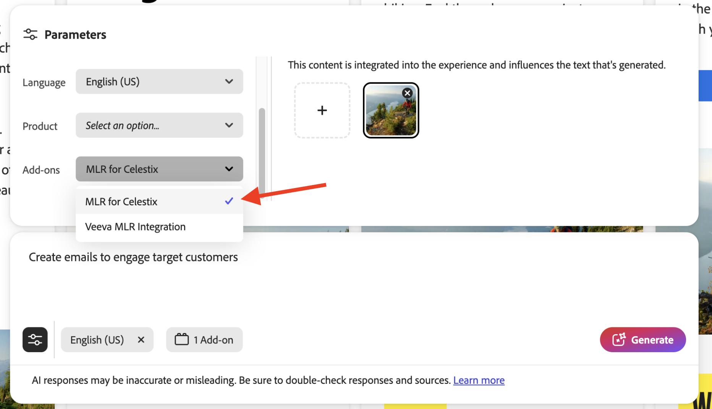
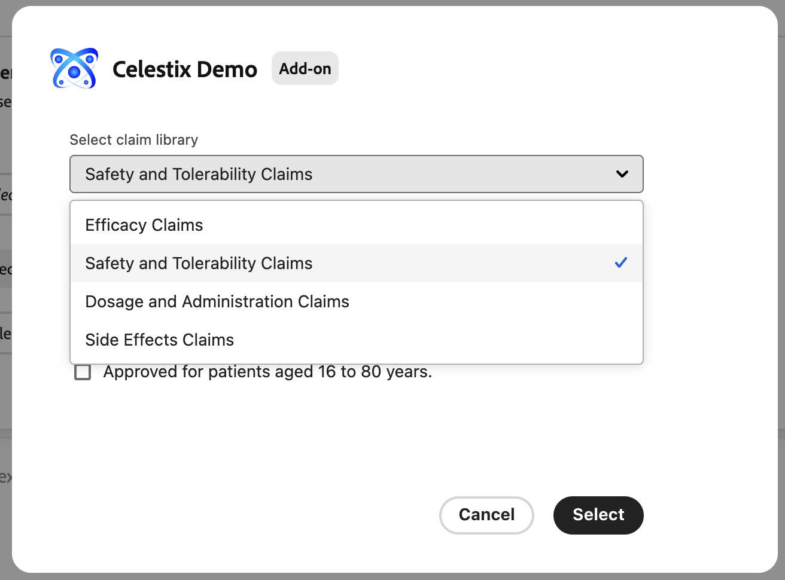
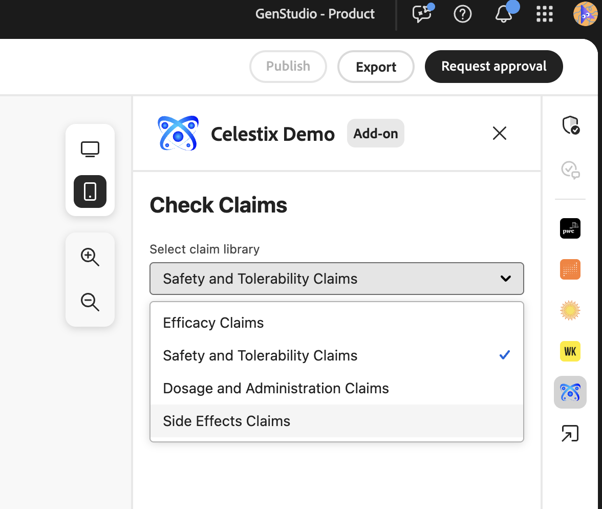
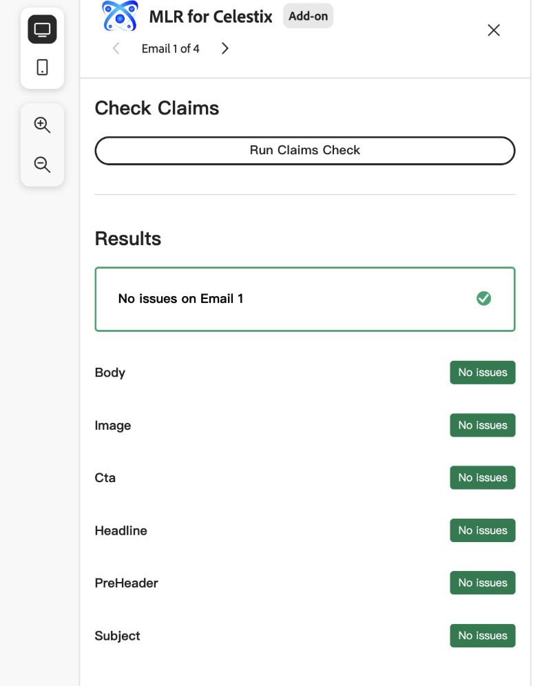
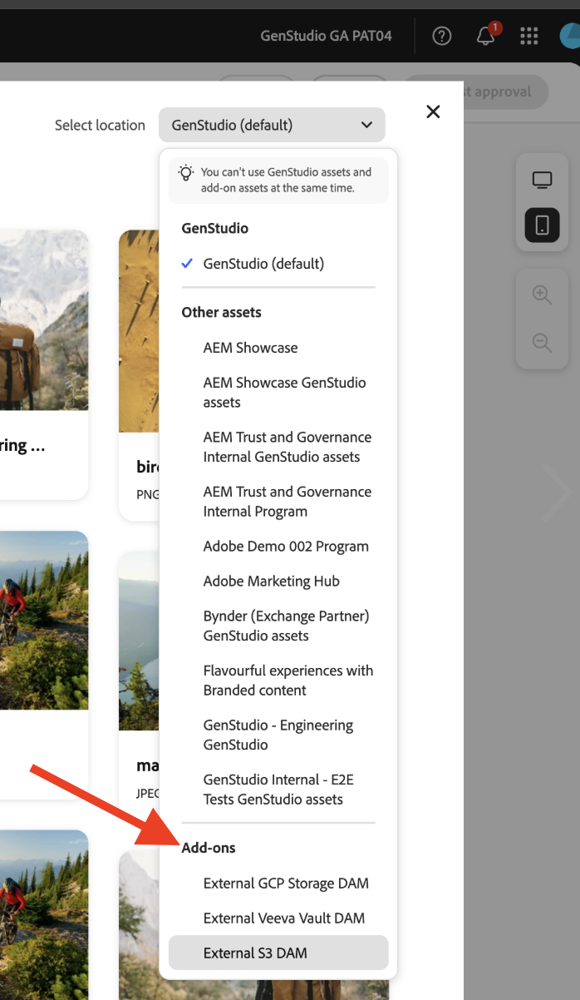

# 部署您的應用程式

執行應用程式可提供附加元件在部署前的初步行為快照。 這有助於偵錯。

## 執行應用程式

在`https://localhost:9080`中執行應用程式：

```bash
aio app run
```

## 部署應用程式

1. 導覽至您的部署工作區：

   ```bash
   aio app use -w [deployment_workspace]
   ```

2. 部署應用程式：

   ```bash
   aio app deploy
   ```

## 強制重新部署

您可以強制建立及部署應用程式，而不需重新提交以進行核准。

>[!NOTE]
>
>強制建置和部署會覆寫您現有的部署。 **請先在測試環境中完整測試您的應用程式**。

```bash
aio app build --force-build
```

```bash
aio app deploy --force-deploy
```

## 同時建置和部署

```bash
aio app deploy --force-build --force-deploy
```

## 尋找您的新應用程式

部署後，您可以在GenStudio for Performance Marketing中檢視新的應用程式。

### 使用URL檢視

將`query`引數新增至GenStudio for Performance Marketing URL以檢視新應用程式：

```txt
https://experience.adobe.com/?ext=https://<my-deployed-add-on>.adobeio-static.net/index.html#/@<ims-org>/genstudio/create
```

### 在使用者介面中檢視

根據您部署的擴充功能型別，可在UI中的不同位置找到新擴充功能。 目前可用的擴充功能點包括：

* 合規性擴充功能，包括：
   * [*提示延伸點*](#find-prompt-extensions)，可讓客戶新增其他內容至LLM產生，以及
   * [*驗證延伸點*](#find-validation-extensions)，可讓客戶驗證LLM產生的內容。 驗證通常會與「提示」延伸功能搭配使用，以確保以延伸提示產生的內容符合客戶要求（例如，醫療藥品索賠或法律）
* [數位資產管理(DAM)擴充功能](#find-dam-extensions)
* [範本副檔名](#find-template-extensions)
* [翻譯擴充功能](#find-translation-extensions)

### 尋找提示副檔名

在範本的&#x200B;**引數區段**&#x200B;的&#x200B;**附加元件**&#x200B;下拉式清單中找到提示副檔名。

{width="600" zoomable="yes"}

附加元件對話方塊將會開啟，讓您選取要為LLM產生新增的其他前後關聯。

{width="600" zoomable="yes"}

### 尋找驗證擴充功能

產生提示後，可在與結果一起顯示的右側找到驗證延伸模組。

{width="600" zoomable="yes"}

執行您選取的擴充功能以驗證產生的內容。

{width="600" zoomable="yes"}

### 尋找DAM擴充功能

在範本的&#x200B;**引數區段**&#x200B;中選取內容時，找到數位資產管理(DAM)擴充功能。 檢視&#x200B;**選取位置**&#x200B;下拉式清單的底部以檢視任何附加元件。

{width="600" zoomable="yes"}

### 尋找範本擴充功能

選取範本時，可在&#x200B;**外部範本應用程式**&#x200B;索引標籤中找到範本擴充功能。 只有在有可選取的範本應用程式時，才會顯示此索引標籤。

{width="600" zoomable="yes"}


### 尋找翻譯擴充功能

使用翻譯擴充功能點，透過Proxy提供您自己的翻譯服務，而不使用GenStudio預設翻譯。
這些擴充功能沒有使用者介面位置。

如果已註冊擴充功能，則會使用提供的翻譯服務。 否則會使用預設的GenStudio翻譯服務。


如果您對您的附加元件感到滿意，您就可以不使用`query`引數來分配它。

您現在可以[散發您的應用程式](distribute-app.md)。
