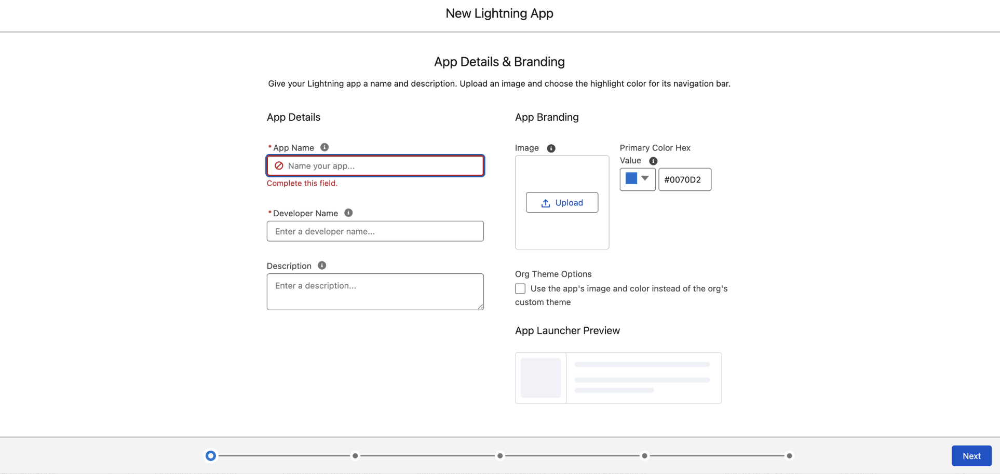

# Salesforce中的Experience Selector MFE

本主題說明客戶與實作人員如何在Salesforce組織中部署及執行[!DNL GenStudio for Performance Marketing] Experience Selector微前端(MFE)。 內容涵蓋管理員步驟（無程式碼）、開發人員步驟（部署和設定），以及安全性相關設定，例如內容安全性原則(CSP)。

如需一般MFE整合選項、組態屬性和架構範例，請參閱[GenStudio Experience Selector MFE](experience-selector.md)。

## 這項整合的作用

>[!VIDEO](https://video.tv.adobe.com/v/3491079?learn=on)

Lightning Web Component (LWC) `sfgsmfe`會載入Adobe的Experience Selector UMD套件組合併在`<dialog>`中呈現，讓使用者可以從[!DNL GenStudio for Performance Marketing]中挑選體驗。

整合也可以：

* **預覽和解碼：**&#x200B;在LWC內將選取的承載顯示為JSON、解碼的HTML和經過清理的HTML預覽。
* **電子郵件範本（選用）：** Salesforce中的&#x200B;**[!UICONTROL 建立電子郵件範本]**&#x200B;流程可以呼叫Apex (`EmailTemplateController.createEmailTemplate`)來插入`EmailTemplate`記錄（HTML、主旨和資料夾）。
* **執行階段載入：** GenStudio指令碼是從`experience.adobe.com`上的Adobe代管URL載入，而非從一般實作中的Salesforce靜態資源載入。

## 先決條件

* **Salesforce組織：**&#x200B;可部署中繼資料及使用&#x200B;**[!UICONTROL Lightning App Builder]**&#x200B;的沙箱或生產組織。
* **Salesforce CLI：** Salesforce CLI (`sf`)已安裝且已驗證，例如：

  ```bash
  sf org login web --alias <your-org-alias>
  ```

* **許可權：**&#x200B;建立電子郵件範本的使用者需要存取目標電子郵件範本資料夾，以及根據您的組織原則建立範本的許可權。 頂點執行`with sharing`。
* **Adobe / GenStudio：**&#x200B;您的Adobe IMS組織ID和SUSI `clientId`必須符合您的Adobe設定（請參閱[設定整合值](#configure-integration-values-developer--implementation)）。
* **瀏覽器/CSP：** Salesforce必須允許從`https://experience.adobe.com`載入指令碼（請參閱[設定內容安全性原則及Adobe URL](#configure-content-security-policy-and-adobe-url)）。

## 部署套件（開發人員）

整合遵循Salesforce DX樣式配置。 您的Salesforce DX專案中的預設套件目錄通常是`force-app`。

1. 從您的專案根目錄，將來源部署至目標組織：

   ```bash
   sf project deploy start --source-dir force-app --target-org <your-org-alias>
   ```

2. 確認部署完成且沒有錯誤。

專案中典型的中繼資料包括：

* 名為`sfgsmfe`的LWC套件（HTML、JavaScript、CSS和中繼XML），裝載選擇器UI和指令碼載入。
* Apex類別（例如`EmailTemplateController`），會在您使用該選擇性流程時建立電子郵件範本。

您的專案也可以定義靜態資源。 如果LWC載入器使用`standalone.js`的Adobe CDN URL，除非您變更實作，否則該載入路徑不需要這些資源。

## 將元件新增至「閃電」頁面（管理員）

`sfgsmfe`元件已公開：

* 閃電應用程式頁面
* 首頁
* 記錄頁面
* 索引標籤（將元件放在從自訂索引標籤開啟的Lightning頁面上）

若要新增元件：

1. 在&#x200B;**[!UICONTROL 設定]**&#x200B;中，開啟&#x200B;**[!UICONTROL 應用程式管理員]**。
1. 建立&#x200B;**[!UICONTROL 新的Lightning應用程式]** （或開啟您要擴充的現有應用程式）。
   {width="80%" zoomable="yes"}
1. 開啟應用程式並選取&#x200B;**[!UICONTROL 編輯]**。
   {width="80%" zoomable="yes"}
1. 建立&#x200B;**[!UICONTROL 新頁面]** （或編輯現有的「閃電」頁面）。
   {width="60%" zoomable="yes"}
1. 在&#x200B;**[!UICONTROL 閃電App Builder]**&#x200B;中，將&#x200B;**sfgsmfe**&#x200B;元件拖曳到配置圖上。
1. **[!UICONTROL 儲存]**、**[!UICONTROL 啟動]**，並將頁面指派給正確的Lightning應用程式、設定檔和應用程式可見度，以便目標使用者可以開啟它。

## 設定內容安全性原則及Adobe URL

LWC會插入其`src`指向Adobe之UMD組合包的`<script>`標籤，例如：

`https://experience.adobe.com/solutions/GenStudio-experience-selector-mfe/static-assets/resources/@genstudio/experience-selector/umd/standalone.js`

您必須設定Salesforce，才能根據貴組織的CSP和Lightning安全性設定，允許此來源載入指令碼。

如果指令碼無法載入：

1. 開啟瀏覽器開發人員工具。
1. 檢查&#x200B;**[!UICONTROL 主控台]**&#x200B;和&#x200B;**[!UICONTROL 網路]**&#x200B;索引標籤中是否有封鎖的要求或CSP違規。
1. 依照Lightning的目前Salesforce檔案，新增或調整`https://experience.adobe.com`的&#x200B;**[!UICONTROL CSP Trusted Sites]** （以及您的Salesforce版本的任何相關設定）。

## 設定整合值（開發人員/實作）

在LWC JavaScript中為`sfgsmfe`設定了數個值。 客戶通常會根據環境更換這些裝置。

| 值 | 說明 |
| --- | --- |
| `folderId` | 用於建立新範本之電子郵件範本的Salesforce資料夾識別碼(`00l...`)。 Apex需要；資料夾必須存在且可供執行中的使用者存取。 |
| `imsOrg` | 傳遞至`GenStudioExperienceSelector.renderExperienceSelectorWithSUSI`的Adobe IMS組織識別碼。 |
| `susiConfig.clientId` | 適用於Experience Selector應用程式註冊的Adobe SUSI使用者端ID。 |
| GenStudio `script.src` | UMD `standalone.js`套件組合的URL；如果Adobe發佈新路徑，請更新。 |

電子郵件範本建立將GenStudio欄位對應至範本（例如，來自`experienceFields`的主旨）。 如果內容模型不同，請調整LWC中的對映。

如需`renderExperienceSelectorWithSUSI`及相關選項的詳細資訊，請參閱Experience Selector MFE主題中的[組態屬性](experience-selector.md#configuration-properties)。

## Apex： EmailTemplateController

`EmailTemplateController.createEmailTemplate`通常會：

* 驗證範本名稱、資料夾ID及非空白的HTML。
* 建立具有`TemplateType = 'custom'`、`HtmlValue`、`Subject`、`Body`和資料夾指派的`EmailTemplate`。
* 透過`AuraHandledException`到LWC的曲面錯誤。

營運秘訣：

* 尊重組織中的DeveloperName唯一性和命名規則。
* 確認資料夾識別碼，並確認使用者可在該資料夾中建立`EmailTemplate`記錄。
* 當DML無法擷取確切錯誤時，請使用Salesforce除錯記錄檔。

## 驗證檢查清單

在部署和設定後使用此清單：

* [ ]部署完成，沒有錯誤。
* [ ]使用者可以開啟包含`sfgsmfe`的Lightning頁面。
* [ ]元件未顯示載入錯誤；[網路]索引標籤傳回`standalone.js`的HTTP 200。
* [ ] **[!UICONTROL 選取GenStudio Experience]**&#x200B;會開啟選取器並執行選取範圍回呼。
* [ 當您使用該流程時，] **[!UICONTROL 建立電子郵件範本]**&#x200B;成功，範本出現在&#x200B;**[!UICONTROL 設定]**&#x200B;中已設定的資料夾下。

## 另請參閱

* [GenStudio體驗選擇器MFE](experience-selector.md)
