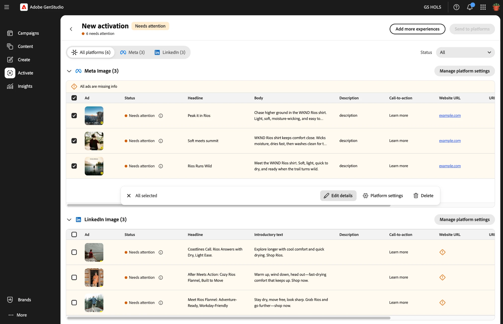
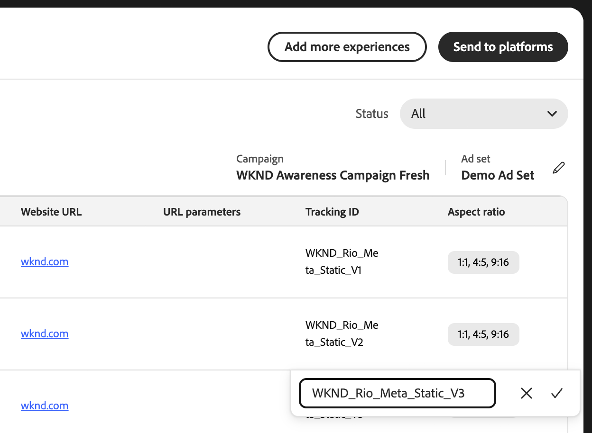

# 啟用工作流程

[!DNL Activate]將發佈的體驗啟用至其付費廣告平台。 GenStudio for Performance Marketing體驗是行銷活動元件（例如廣告），可為付費廣告平台上的特定受眾做準備。 啟用的體驗包含三個主要元件：

* **媒體資產**：廣告體驗中的影像或視訊，其檔案型別和外觀比例會因平台和格式而異。

* **文字**：廣告中包含所有形式的復本，包括標題、內文和call-to-action元素。

* **中繼資料**：使用者定義的屬性（通常對廣告對象不可見），可增強效能分析、篩選和追蹤。

您啟動前，已在[!DNL Content]中準備並核准這些元件。 [!DNL Activate]不會建立或編輯已核准的資產、標題或內文。 它只會套用每個平台所需的設定，然後發佈體驗。

單一啟用表格可包含多個付費廣告平台和廣告格式的體驗。

>[!VIDEO](https://video.tv.adobe.com/v/3503538?learn=on)

## 連線您的平台帳戶

GenStudio系統管理員或編輯器必須連線每個付費廣告平台的廣告帳戶，您才能為該平台啟用體驗。 若要檢視此程式的步驟，請參閱[連線付費媒體帳戶](/help/user-guide/connectors/connect-channel.md)。

## 開始啟用

從下列兩個進入點之一開始啟動：

* **從[!DNL Content]**：篩選至體驗，選取一或多個發佈的體驗，然後按一下頂端動作列上的&#x200B;**[!UICONTROL 啟用]**。

  ![在內容中選取已發佈的體驗，然後按一下[啟動]開始啟動](./images/content-select-activate.png)

* **從[!DNL Activate]**：在[!DNL Activate]登陸頁面上，按一下&#x200B;**[!UICONTROL +新啟用]**。 這會開啟相同的體驗收藏館，您可在此處選取要啟用的體驗。

無論是哪種情況，都可依體驗名稱搜尋，或依多個管道篩選以尋找您想要的體驗。

如果您的選取範圍包含顯示格式體驗，請指定要使用的顯示平台： Google Campaign Manager 360、Innovid、Amazon Ads或交易台。 然後按一下&#x200B;**[!UICONTROL 開始啟用]**。 對於其他格式，例如Meta、LinkedIn、TikTok、YouTube和ChatGPT，[!DNL Activate]會推斷體驗頻道的平台，並略過此步驟。

[!DNL Activate]接著會產生啟用表格，列出所有您選取的體驗。

[!DNL Activate]會依廣告格式和平台將表格組織為子表格，例如Meta單一影像或LinkedIn單一影像。 每一列代表一個廣告。 對於大部分的平台，例如LinkedIn、TikTok和顯示平台，具有多種外觀比例的體驗會產生每一種外觀比例一列；請刪除您不需要的任何列。 Meta是個例外。 Meta廣告可以在單一廣告中包含多個外觀比例，因此多外觀比例Meta體驗仍只會產生一列。

## 管理您的啟用表格

您的啟動表格在開啟時自動儲存為草稿。 您可以在發佈之前隨時離開並繼續草稿。

若要新增更多體驗至您已開啟的啟用表格，請按一下表格右上角的&#x200B;**[!UICONTROL 新增更多體驗]**。 這會重新開啟體驗庫，讓您可以選取其他體驗，這些體驗會由[!DNL Activate]新增至現有表格。

**[!UICONTROL 新增更多體驗]**&#x200B;也可讓您在同一個資料表中啟用多個顯示平台。 顯示格式體驗會要求您先選擇單一顯示平台，但您可以按一下&#x200B;**[!UICONTROL 新增更多體驗]**、選取更多顯示格式體驗，以及選擇與表格中現有平台不同的顯示平台。 例如，您可以將「交易台」廣告新增至已包含「Innovid」廣告的表格。

一旦您的表格有正確的體驗，接著請設定每個廣告的欄位。

## 設定廣告和平台設定詳細資料

編輯每列內嵌欄位，或在相同格式表格中選取多個列，然後按一下工具列上的[編輯詳細資料] ****，該工具列似乎可一次大量編輯這些欄位。

核准的資產、標題和正文已鎖定，無法在啟用表格中編輯，因為它們已在[!DNL Content]中通過稽核和核准。 其餘欄位可編輯，並可因平台而異。 [!DNL Activate]只會顯示與您選取的平台和格式相關的欄。 使用下表作為每個平台可編輯內容的參考。

**平台可編輯的欄位**

| Platform | 支援的格式 | 鎖定的副本 | 可編輯的文字欄位 | 可編輯的平台設定欄位 |
|---|---|---|---|---|
| Meta | 影像、影片、輪播 | 標題，正文 | 說明、Call-to-action、目的地URL、URL引數、追蹤ID | 廣告帳戶、Facebook頁面、Instagram設定檔、Meta行銷活動、Meta廣告集 |
| LinkedIn | 單一影像、單一視訊 | 標題，簡介文字 | 說明、Call-to-action、目的地URL、URL引數、追蹤ID | 廣告帳戶、行銷活動、廣告集 |
| Google Campaign Manager 360 | 靜態顯示、視訊顯示、HTML5 Zip顯示 | N/A | 追蹤ID | 廣告商 |
| Amazon Ads | 靜態顯示 | N/A | 追蹤ID | 帳戶 |
| 無資訊 | 靜態顯示、HTML5 Zip顯示 | N/A | 追蹤ID | 帳戶， Creative資料庫，概念名稱 |
| TikTok | 動態消息視訊廣告 | 主要文字 | call-to-action、目的地URL、追蹤ID | 廣告帳戶、行銷活動、廣告群組 |
| YouTube | Google Ads Demand Gen行銷活動中的Shorts | 說明 | call-to-action、企業名稱、目的地URL、URL引數、追蹤ID | 帳戶、行銷活動、廣告群組、標誌 |
| ChatGPT | 聊天卡 | 標題，內文 | 目標URL、追蹤ID | OpenAI廣告帳戶、OpenAI行銷活動、OpenAI廣告群組 |
| 交易台 | 靜態顯示 | N/A | 追蹤ID | 帳戶、行銷活動 |

若要設定一組廣告格式的平台設定欄位，請按一下[管理平台設定] ****，並編輯結果對話方塊中的欄位。

每個&#x200B;**[!UICONTROL 追蹤ID]**&#x200B;欄位都會預先填入體驗名稱：廣告平台會使用此值作為廣告名稱或創意名稱來報告和疑難排解。 如果您想使用其他專案，請就地編輯值。

若要更快速地在&#x200B;**[!UICONTROL 追蹤ID]**&#x200B;欄位之間移動，請使用下列鍵盤快速鍵：

* 按下&#x200B;**Enter**&#x200B;以開啟所選&#x200B;**[!UICONTROL 追蹤ID]**&#x200B;的編輯欄位。
* 按下&#x200B;**向上**&#x200B;或&#x200B;**向下**&#x200B;方向鍵，移至該欄位中的上一個或下一個&#x200B;**[!UICONTROL 追蹤ID]**&#x200B;欄位。
* 再次按&#x200B;**Enter**&#x200B;以儲存您的編輯。

## 檢閱您的體驗並發佈至其廣告平台

確認每一列顯示[!UICONTROL 準備啟動]。 [!DNL Activate]將遺漏或無效的欄位標示為旗標、不相容的動作呼叫，以及重複的追蹤ID標示為[!UICONTROL 需要注意]。 當每一列準備就緒時，按一下&#x200B;**[!UICONTROL 傳送至平台]**，然後在發佈對話方塊中確認。

![啟用表格，其中每一列顯示[準備啟用]，啟用[傳送至平台]](./images/ready-to-activate.png)

[!DNL Activate]近乎即時報告每個廣告的狀態：擱置中，然後傳送至平台或失敗。 如果廣告失敗，將滑鼠停留在其狀態上可檢視平台的錯誤。 您可以按一下&#x200B;**[!UICONTROL 再試一次]**，一次重試表格中每個失敗的廣告，而不是個別重試每個廣告。 已傳送至平台的列會因重新提交而被鎖定，且會在目的地平台的原生廣告管理員中納入廣告的深層連結。 您的最終發佈前稽核和啟動廣告會在目的地平台自己的廣告管理員中進行： [!DNL Activate]一律會以非使用中狀態傳送廣告。

您的啟用表格會顯示在[!DNL Activate]登陸頁面上。

## 支援平台

每個付費廣告平台都有特定的設定欄位和先決條件。 選取付費廣告平台以取得啟用准則：

* [Meta](activate-meta-ad.md)
* [LinkedIn](activate-linkedin-ad.md)
* [Google行銷活動管理員360](activate-cm360-ad.md)
* [Amazon廣告](activate-amazon-ad.md)
* [無](activate-innovid-ad.md)
* [TikTok](activate-tiktok-ad.md)
* [YouTube](activate-youtube-ad.md)
* [ChatGPT](activate-chatgpt-ad.md)
* [交易台](activate-trade-desk-ad.md)
