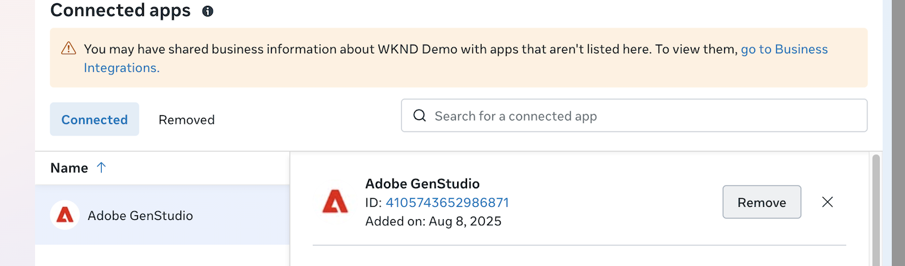

# 連線至Meta Ads

此頁面說明如何將您的Meta Ads設定檔帳戶連線並管理至GenStudio for Performance Marketing，以管理行銷活動、匯出內容，並存取您使用中行銷活動的廣告資料。

>[!BEGINSHADEBOX]

**必要條件**：

- 可存取所有Meta服務的Facebook/Meta登入

- _完全控制_ Meta商業Portfolio和廣告帳戶，包括：

   - 管理行銷活動
   - 檢視效能
   - 管理Creative中心模型
   - 進階分析

- 停用瀏覽器中的任何快顯封鎖程式

>[!ENDSHADEBOX]

## 連線Meta ads帳戶

1. 按一下&#x200B;**[!UICONTROL 更多]** > **[!UICONTROL 設定]**。

1. 在&#x200B;_Data Connectors_&#x200B;區段中，按一下&#x200B;**[!UICONTROL Meta Ads]**&#x200B;卡片上的&#x200B;_連線_。

1. 登入您的Facebook帳戶。

   您可能必須移除快顯視窗封鎖程式，然後使用&#x200B;**[!UICONTROL 重新整理]**&#x200B;再試一次。

1. 遵循Facebook驗證指示，驗證帳戶資訊，然後按一下&#x200B;**[!UICONTROL 繼續為……]**

1. 在&#x200B;_[!UICONTROL 商務用Facebook登入]_ (Meta至Adobe符號)中，逐步執行下列選取專案以授予GenStudio for Performance Marketing存取權：

   - 選取一或多個Meta企業設定檔，然後按一下&#x200B;**[!UICONTROL 繼續]**
   - 選取一或多個Meta頁面，然後按一下&#x200B;**[!UICONTROL 繼續]**
   - 選取一或多個Instagram帳戶，然後按一下&#x200B;**[!UICONTROL 繼續]**
   - 檢閱選取專案並按一下&#x200B;**[!UICONTROL 儲存]**

     {width="400" zoomable="yes"}

1. 收到帳戶已連線的驗證後，請按一下&#x200B;**[!UICONTROL 取得]**。

   此步驟可確保GenStudio for Performance Marketing取得所有廣告、中繼資料和量度的存取權，以發揮最佳效能。

1. 在&#x200B;_[!UICONTROL Meta Ads]_&#x200B;中，選取一或多個要包含在[!DNL Insights]中的帳戶，然後按一下&#x200B;**[!UICONTROL 選取]**。

1. 收到&#x200B;_平台已連線_&#x200B;的確認之後，請按一下&#x200B;**[!UICONTROL 檢視帳戶]**。

   _[!UICONTROL Meta Ads帳戶]_&#x200B;檢視會列出`Account name`、`Added by`、`Date added`和`Status`。

   {zoomable="yes"}

使用&#x200B;**[!UICONTROL 新增帳戶]**&#x200B;將更多帳戶新增至清單。 當您新增連結至相同Meta企業設定檔的帳戶時，授權流程可能會稍微不同。 在連線過程中，您只能選取新的Meta Ads帳戶。

## 中斷與Meta Ads整合的連線並進行疑難排解

有時GenStudio for Performance Marketing執行個體無法正確連線至Meta Ads帳戶。 可能導致問題的常見設定包括：

- 已選取Instagram帳戶，但未選取其相關聯的Facebook頁面
- 已撤銷執行初始連線的使用者許可權

在這些情況下，最好將Meta廣告帳戶重新連線至GenStudio for Performance Marketing執行個體。 首先，使用者必須直接從其Meta Business Manager中移除應用程式整合，為重設許可權建立一個全新的平台。 這需要Meta Business Manager的管理員存取權。

下列步驟會清除快取許可權並重設整合流程：

1. 造訪Facebook網站以存取[Meta Business Manager](https://business.facebook.com)。
1. 使用您的帳戶登入。 此帳戶必須擁有Business Manager的管理員存取權。
1. 按一下左下角的&#x200B;**[!UICONTROL 設定]**&#x200B;圖示以導覽至您的Business Portfolio設定。
1. 在左側功能表中，按一下&#x200B;**[!UICONTROL 整合]**。
1. 選取&#x200B;**[!UICONTROL 連線的應用程式]**。 您將會在「連線應用程式」清單中看到Adobe GenStudio。
   
1. 按一下應用程式名稱。
1. 按一下&#x200B;**[!UICONTROL 移除]**。
1. 出現提示時確認移除。

您現在可以重新連線Meta廣告帳戶、Instagram設定檔和Facebook頁面。
