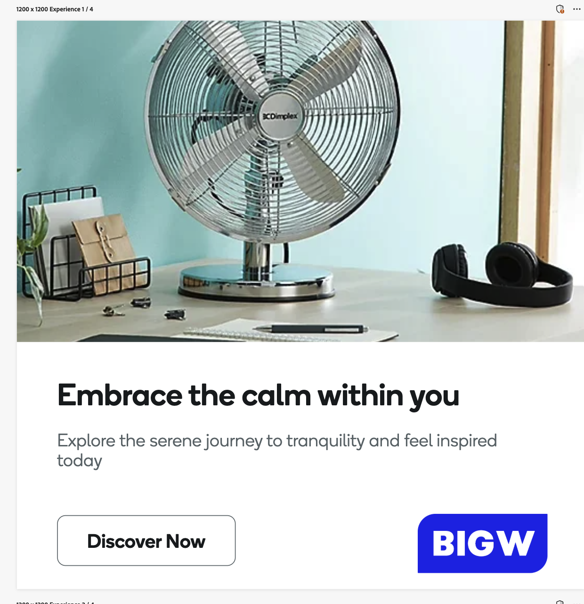

# 使用範本的最佳實務

範本提供包括預先設定版面和設計元素的起點，大幅減少產生新內容所需的時間和精力。

搭配GenStudio for Performance Marketing使用範本時，請使用下列建議：

1. 瞭解[範本元素](#know-about-template-elements)
1. 設定[頻道准則](#configure-channel-guidelines)，以有效個人化內容
1. 使用[協助工具標準](accessibility-for-templates.md)進行設計，以獲得最佳體驗
1. 遵循[特定管道的範本准則](#follow-channel-specific-template-guidelines)

>[!TIP]
>
>在[使用範本](use-templates.md)中進一步瞭解基本範本元素和程式。 深入探討[自訂範本](customize-template.md)以用於您的下一個行銷活動。

## 瞭解範本元素

請熟悉範本的各個部分，當作最佳作法。 每種範本型別使用不同元素來建立通道特定內容建立的結構。 若要自訂您的範本，請使用欄位名稱，取代您需要GenStudio for Performance Marketing產生內容的這些元素。

請參閱[範本元素](use-templates.md#template-elements)。

## 設定頻道准則

定義明確的管道指引是確保產生的內容符合品牌需求和目標的關鍵。 色版指導方針可讓您指定範本中所使用元素的規則，例如色調、長度和樣式。 例如，您可以設定內文的字元數上限，或需要特定的call-to-action樣式。 透過預先設定這些准則，您就不需要在每個AI提示中寫出詳細指示，簡化內容產生流程並確保電子郵件的一致性。

檢閱並定義範本中所有主要欄位之品牌的[頻道指導方針](/help/user-guide/guidelines/brands.md#channel-guidelines)。 如果您未定義准則，則會套用[預設管道准則](/help/user-guide/guidelines/brands.md#default-channel-guidelines)，這可能無法完全反映您的品牌需求。

瞭解[品牌、產品和角色准則](/help/user-guide/guidelines/overview.md)如何影響產生的內容，以及如何根據您的行銷目標量身打造內容。

## 正在上傳範本的影像

範本中使用的影像應來自內容存放庫，且必須正確上傳以確保影像正確顯示。

當範本具有邊緣對邊緣（完整出血）影像時，選取的影像會自動調整大小以符合完整範本尺寸。 不過，如果影像不符合範本外觀比例，則會裁切影像以符合範本尺寸，且可能無法如預期顯示。

範本中包含的影像沒有「自動調整」功能。

若要解決影像裁切問題，使用者必須定義將影像上傳至內容存放庫時，範本中要使用的影像外觀比例。 上傳已核准的範本時：

1. [繼續範本上傳程式](/help/user-guide/content/use-templates.md#add-a-template)，直到您到達&#x200B;**[!UICONTROL 新增詳細資料]**&#x200B;頁面。

2. 以&#x200B;**[!UICONTROL 廣告寬度(px)]**&#x200B;和&#x200B;**[!UICONTROL 廣告高度(px)]**&#x200B;定義範本中要使用的影像外觀比例。 這會為顯示影像的範本區段定義影像視窗。

3. 在&#x200B;**[!UICONTROL 更多詳細資料]**&#x200B;區段中，選取&#x200B;**[!UICONTROL 影像大小]**&#x200B;下拉式清單，並選擇&#x200B;_裁切成固定大小_。
   {width="80%"}

若要在瀏覽器中決定影像的大小與外觀比例：

1. 檢查影像。
   - Windows/Linux：
      - 按F12。
   - macOS：
      - 按下Command + Option + I。

1. 將滑鼠停留在影像上。

1. 請注意外觀比例。 使用此專案來定義範本中影像的外觀比例。

上傳期間未套用這些詳細資料時，系統假設影像是範本的整個外觀比例，若影像與該外觀比例不完全相符，系統就會裁切該影像。

{width="60%"}

顯示廣告範本中的&#x200B;**❌已裁切的影像**

{width="60%"}

**✅影像已完整顯示**

## 遵循特定頻道的範本准則

建立範本時，請確保它們符合預期通道的特定需求。 建立可容納每個管道的版面和視覺需求的範本。 有些一般准則適用於任何範本，例如：

- 使用簡潔且回應式的HTML和內嵌CSS
- 使用Adobe或Google字型
- 請&#x200B;**不**&#x200B;使用JavaScript

{{note-css-effects}}

使用每種範本型別時，請參閱進一步的提示和限制以確保最佳效能：

- [電子郵件](/help/user-guide/templates/email-template.md)
- [顯示廣告和橫幅廣告](/help/user-guide/templates/display-template.md)
- [LinkedIn](/help/user-guide/templates/linkedin-template.md)
- [Meta廣告](/help/user-guide/templates/meta-template.md)
