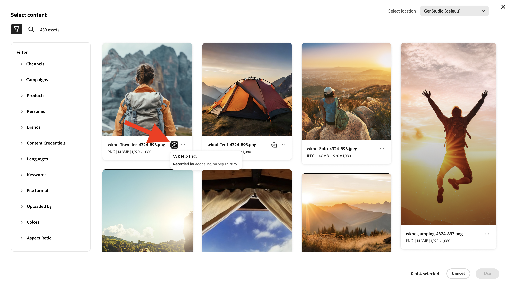
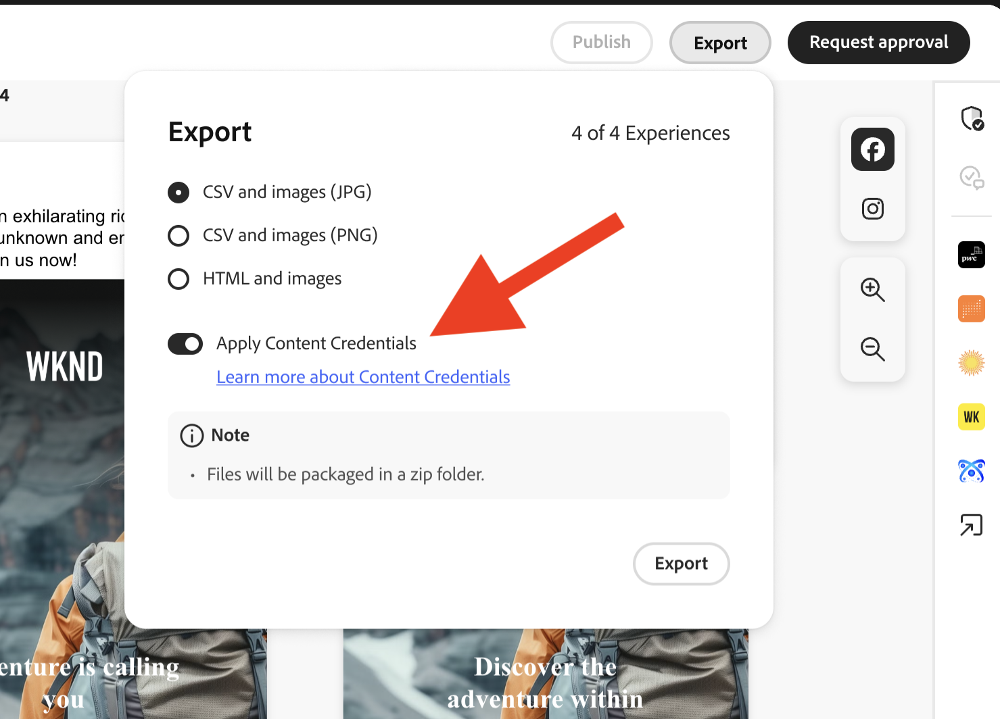
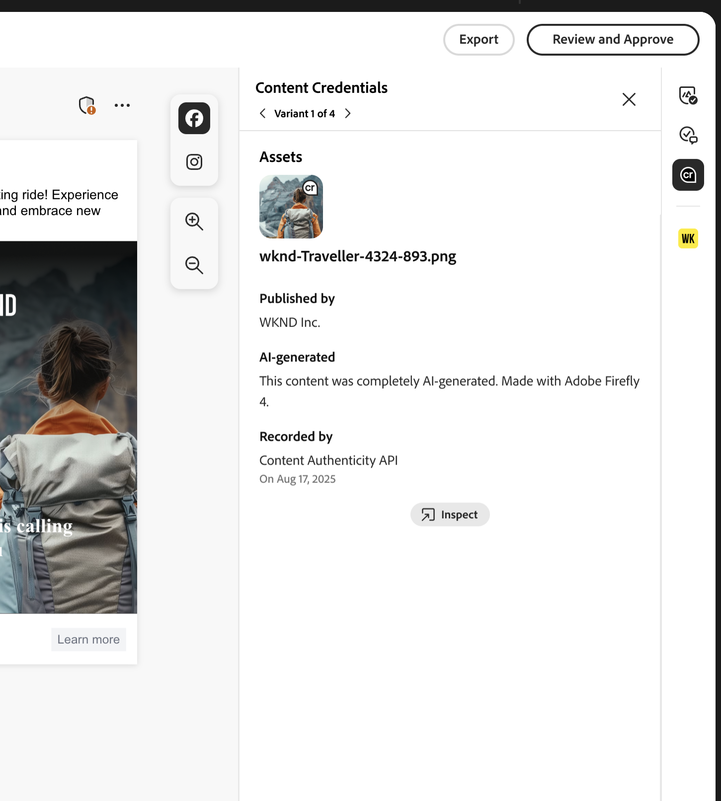
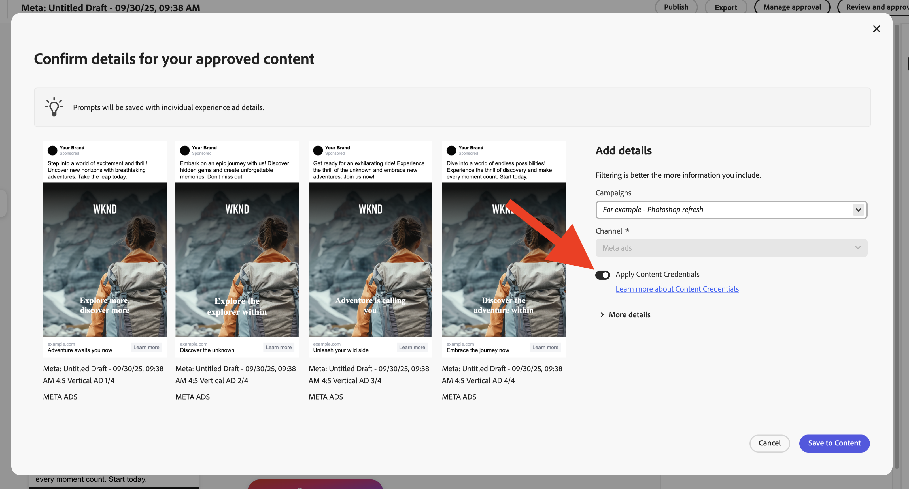
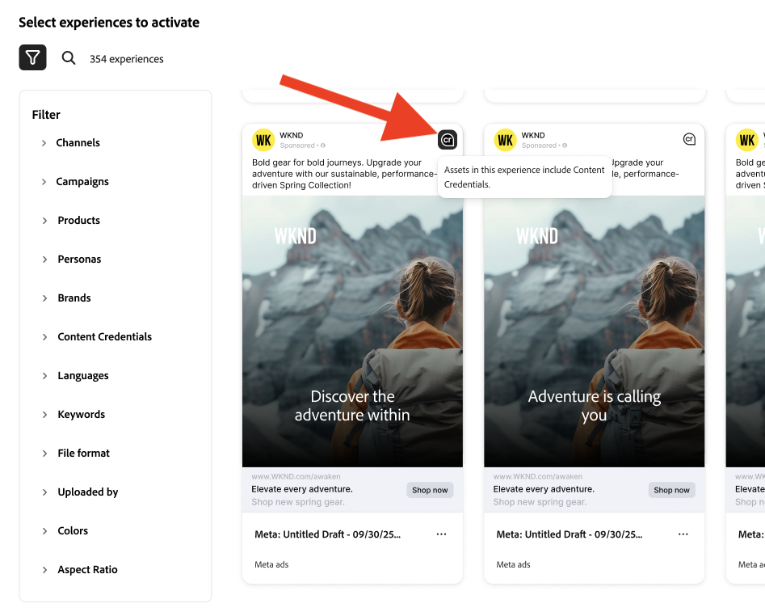
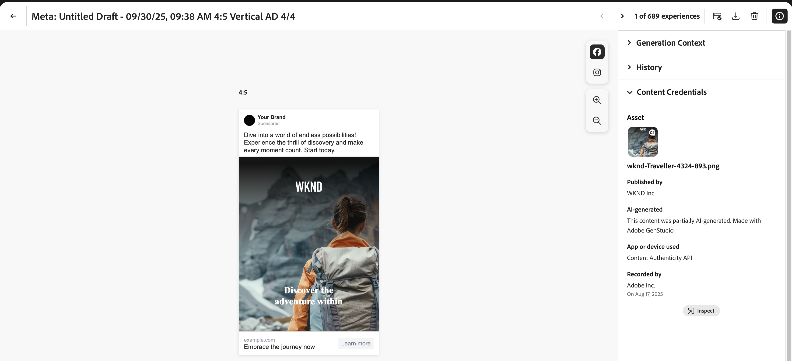

# 適用於組織的Content Credentials

瞭解內容防篡改認證如何直接內嵌在行銷工作流程中，以證明品牌真實性並促進法規遵循。

>[!WARNING]
>
>此功能目前為測試版，僅供已獲得存取權的組織使用。 如有興趣，請洽詢您的Adobe客戶團隊代表以進行註冊。

## 開始使用Content Credentials

在Admin Console中啟用Content Credentials後，GenStudio for Performance Marketing使用者就可以在應用程式中為全域所有資產開啟Content Credentials。 如果已關閉套用認證的全域選項，使用者可以選擇為每個個別資產套用Content Credentials。

內容發佈後，Content Credentials將顯示在外部平台上，例如LinkedIn。

管理員負責在Admin Console中上傳有效的X.509憑證。 此步驟可確保企業的數位簽章已正確設定，並可在支援的Adobe DX應用程式中使用。

>[!NOTE]
>
>控制此設定日後可能會轉換至Admin Console，精簡各應用程式的Content Credentials管理，並增強行政監督。

## 什麼是Content Credentials？ 

Content Credentials是經久耐用的業界標準中繼資料型別，包含建立內容的詳細資訊以及建立者的身分資訊。 將內容線上發佈至支援平台時，或使用[Adobe的Inspect tool](https://contentauthenticity.adobe.com/inspect)或[Adobe Content Authenticity Chrome瀏覽器擴充功能](https://helpx.adobe.com/creative-cloud/help/cai/adobe-content-authenticity-chrome-browser-extension.html)等工具，即可檢視Content Credentials。  

套用Content Credentials有助於提高內容製作方式的透明度，也有助於您的使用者將自己連結到其內容。

[在Adobe進一步瞭解Content Credentials](https://helpx.adobe.com/tw/creative-cloud/help/content-credentials.html)。

## 品牌簽章與資產追蹤

品牌簽署內容在提升品牌完整度和使用者信任度方面扮演重要角色。 在Admin Console中正確設定憑證後，組織便可以在Adobe應用程式中，使用唯一的品牌簽章簽署內容。 這項真實性保證是使用不可見的浮水印和指紋技術來維護，這有助於在內容的整個生命週期中保持簽名的耐久性。

除了品牌簽署外，企業也可以直接將資產ID附加至其內容。 這有助於有效率地追蹤資產，尤其是在社群媒體平台上分享或張貼資產時。 透過合併資產ID，組織可以追蹤其內容的原始和發佈路徑，強化監督和問責。

## 行銷工作流程中的Content Credentials

您可以直接在GenStudio for Performance Marketing中，在整個行銷工作流程中套用Content Credentials，從匯入和內容探索，到啟用和匯出。 您也會找到內容上顯示的認證，以供整個應用程式檢閱。

### 匯入和探索

在內容庫中，認證會顯示在匯入的資產上。

縮圖右上角的Content Credential徽章表示「品牌簽署」內容。

{width="350"}

選取已簽署的內容會顯示詳細的中繼資料：已發佈的品牌、錄製程式、使用的工具、時間戳記。

可依認證狀態篩選內容。

### 建立和選取

Content Credential徽章會顯示在畫布資產選擇器中。

在選取體驗的資產以在整個編輯過程中維護來源鏈時，會保留認證中繼資料。

畫布資產選擇器中的

### 編輯和轉換

從草稿匯出期間，已修改的資產會自動重新簽署，而新的認證會連結至原始資產。

已匯出資產上的{width="300"}

### 檢閱和核准

在「稽核並核准」預覽中，右側邊欄會顯示資產的認證狀態。

{width="300"}

當檢閱者檢查資產時，會顯示每個變體的認證詳細資料。 使用者按一下&#x200B;**[!UICONTROL 儲存至內容]**&#x200B;時，核准的體驗會重新簽署。

### 啟用和匯出

在啟用期間，認證狀態會顯示在Experience選擇器中。

已啟動資產上的{width="350"}

匯出的檔案將會內嵌C2PA相容的認證。

所有支援的格式(JPEG、PNG、MP4)都能維持認證完整性。

已匯出資產上的

