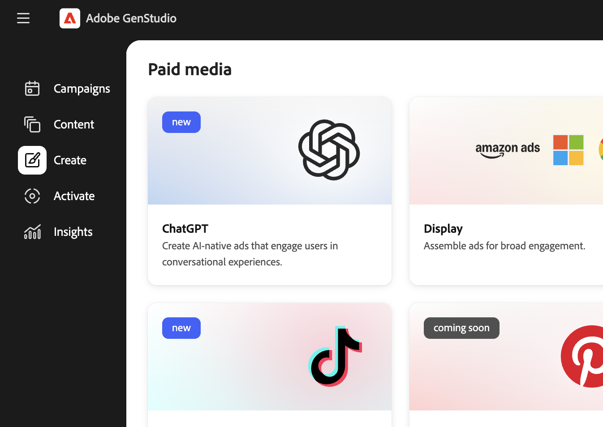

# 建立ChatGPT廣告體驗

在[!DNL GenStudio for Performance Marketing]中使用[[!DNL Create]](/help/user-guide/create/overview.md)來建立&#x200B;**ChatGPT廣告**&#x200B;做為付費媒體體驗，從准則和資產到產生、品牌和管道檢查、核准、發佈到[!DNL Content]，以及在用於Meta和Google Campaign Manager 360等管道的相同[!DNL Activate]流程中進行啟用。

開始之前，請[在需要的地方新增准則](/help/user-guide/guidelines/add-guidelines.md)，並檢閱[有效提示](/help/user-guide/effective-prompts.md)，讓您的標題提示產生強大的變體。

## 先決條件

在[!DNL GenStudio for Performance Marketing]中建立或啟用ChatGPT廣告之前，您必須根據下列先決條件進行設定。

### 存取權和角色

* 您在[!DNL GenStudio for Performance Marketing]中擁有&#x200B;**編輯者**&#x200B;角色或以上版本。 請參閱[使用者角色和許可權](/help/user-guide/user-roles.md)。
* 您有&#x200B;**OpenAI廣告帳戶**&#x200B;和來自該帳戶的&#x200B;**API金鑰**。
* **ChatGPT廣告**&#x200B;帳戶已連線至[!DNL GenStudio for Performance Marketing]。

若要在OpenAI Ads管理員中建立API金鑰：

1. 在OpenAI廣告管理員中，移至&#x200B;**[!UICONTROL 設定]** > **[!UICONTROL API金鑰]** > **[!UICONTROL 建立新金鑰]**。

若要在[!DNL GenStudio for Performance Marketing]中連線您的ChatGPT Ads帳戶：

1. 在左下角區域，按一下&#x200B;**[!UICONTROL 更多]** > **[!UICONTROL 設定]** > **[!UICONTROL ChatGPT]** > **[!UICONTROL 連線]** > **[!UICONTROL 新增帳戶]**。
1. 輸入您的OpenAI Ad帳戶名稱，貼上您的API金鑰，然後按一下&#x200B;**[!UICONTROL 新增帳戶]**。

當流程成功完成時，您的廣告帳戶已連線。

### 建立設定

* 已設定&#x200B;**[!DNL Brands]**、**[!DNL Products]**&#x200B;和&#x200B;**[!DNL Personas]**，讓應用程式可以產生品牌上復本。 請參閱[指南概述](/help/user-guide/guidelines/overview.md)。
* 您想要使用的影像可在[[!DNL Content]](/help/user-guide/content/overview.md)中使用。

## 產生ChatGPT廣告

您在[!DNL Create]工作區中建立ChatGPT廣告作為付費媒體體驗。

### 開始ChatGPT體驗

若要開啟ChatGPT建立：

1. 移至&#x200B;**[!UICONTROL 建立]** > **[!UICONTROL ChatGPT]**。 您未選取ChatGPT的範本；而是使用單一廣告版面配置。
   建立工作流程中的{width="60%"}
1. 在&#x200B;_畫布_&#x200B;中，選取&#x200B;**[!DNL Brand]**、**[!DNL Product]**、**[!DNL Persona]**&#x200B;和&#x200B;**語言**。
1. 從[!DNL Content]中選取影像。
1. 輸入ChatGPT標題復本的提示。
1. 按一下&#x200B;**[!UICONTROL 產生]**。

[!DNL GenStudio for Performance Marketing] **產生四個**&#x200B;創意變體。

您可以：

* 使用&#x200B;**[!UICONTROL 重新產生]**&#x200B;或&#x200B;**[!UICONTROL 調整]**&#x200B;來調整色調、長度或強調。
* 直接在&#x200B;_畫布_&#x200B;中編輯文字。
* 使用&#x200B;**[!UICONTROL 交換]**&#x200B;從[!DNL Content]選擇替代影像。

如需編輯產生體驗的更多方式，請參閱[管理變體](/help/user-guide/create/manage-variants.md)。

### 執行品牌和管道檢查

在儲存或傳送體驗以供檢閱之前，請先根據品牌和管道規則驗證複製和配置。

若要執行內容檢查：

1. 按一下&#x200B;**[!UICONTROL 內容檢查]** （品牌和管道檢查）。
1. 檢閱&#x200B;[_內容檢查_&#x200B;面板](/help/user-guide/guidelines/brand-validation.md#content-check-panel)中的驗證結果。
1. 您可以視需要編輯變體或重新產生內容，以解決任何標幟的問題（例如複製長度或濃密熒幕文字）。

請參閱[品牌驗證](/help/user-guide/guidelines/brand-validation.md)。

## 在[!DNL GenStudio for Performance Marketing]中儲存ChatGPT廣告

儲存會將您的ChatGPT廣告體驗移至[!DNL Content]，以便檢閱、重複使用和啟用。

有兩種狀態：

* **草稿體驗**：工作進行中且未核准。
* **已發佈的體驗**： [!DNL Content]已核准且可供啟用。

### 傳送以供檢閱

1. 在體驗標題中，按一下&#x200B;**[!UICONTROL 要求檢閱]**。
1. 選取核准者（例如品牌、法律或績效利害關係人）。
1. 可選：在&#x200B;**[!UICONTROL 設定]**&#x200B;中新增附註。
1. 按一下&#x200B;**[!UICONTROL 傳送以供檢閱]**。

核准者可以檢視ChatGPT體驗、品牌和管道檢查結果，以及&#x200B;**[!UICONTROL 核准]**&#x200B;或要求變更。

請參閱[要求檢閱和核准](/help/user-guide/approvals/request-review.md)和[檢閱和核准](/help/user-guide/approvals/overview.md)。

### 發佈至內容

在所有必要的核准後，發佈至[!DNL Content]：

1. 按一下&#x200B;**[!UICONTROL 發佈至內容]**。
1. 確認中繼資料，例如行銷活動或啟用名稱、地區、語言、角色、funnel階段，以及&#x200B;**頻道： ChatGPT**。
1. 點擊&#x200B;**[!UICONTROL 發佈]**。

ChatGPT廣告出現在[!DNL Content]中，可透過頻道或促銷活動等篩選器找到，並準備在[!DNL Activate]中選擇。

請參閱[發佈核准的內容](/help/user-guide/approvals/publish-content.md)和[[!DNL Content] 總覽](/help/user-guide/content/overview.md)。

## 啟用ChatGPT廣告

ChatGPT啟用使用與其他付費頻道相同的[[!DNL Activate]](/help/user-guide/activation/overview.md)模組。 請參閱[啟用ChatGPT廣告](/help/user-guide/activation/activate-chatgpt-ad.md)，瞭解ChatGPT的先決條件和設定欄位。
