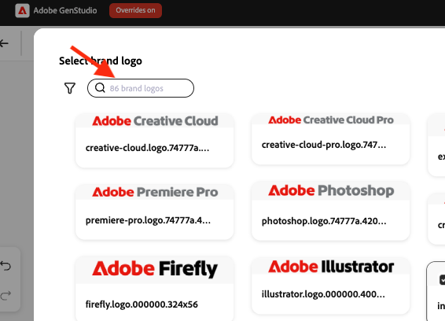

# 在[!DNL Create]中使用標誌交換

在[!DNL GenStudio for Performance Marketing]中建立內容時，使用「圖志交換」取代範本中的品牌圖志。

## 先決條件

- 使用[標誌交換安裝指南](logo-swap-setup.md)設定範本。 只有包含必要標誌預留位置的範本，才會出現「標誌交換」圖示。
- 若要在&#x200B;**[!DNL Create]**&#x200B;工作流程期間擁有可互換的圖志，必須有&#x200B;**[!DNL Brands]**&#x200B;中儲存的圖志。

## 在內容建立期間交換標誌

1. 在&#x200B;**[!DNL Create]**&#x200B;中，選取登陸頁面上的管道。
1. 選擇包含可交換標誌的範本。 範本預覽會顯示出現標誌的灰色預留位置方塊。
   {width="300"}
1. 照常建立內容。 四個變體隨即出現。
1. 將滑鼠停留在標誌區域上，以顯示預留位置。
   {width="200"}
1. 按一下品牌標誌區域，然後按一下&#x200B;**[!UICONTROL 從內容交換]**。
   從內容{width="200"}
1. 在「品牌標誌」面板中，選取標誌，然後按一下&#x200B;**[!UICONTROL 使用]**&#x200B;以將其套用至目前的變體，或按一下&#x200B;**[!UICONTROL 套用至所有變體]**&#x200B;以將其套用至所有四種變體。
1. 您也可以依品牌名稱或篩選條件使用搜尋標誌來尋找標誌。
   {width="300"}
1. 或使用篩選搜尋來尋找標誌。
   {width="300"}
1. 成功更換標誌後，繼續內容建立工作流程（關閉草稿、匯出或請求核准）。

圖志可隨時再次更換。

>[!NOTE]
>如果「圖志交換」圖示未顯示，請確認範本已設定為「圖志交換」，且圖志可在[!DNL Brands]中使用。
