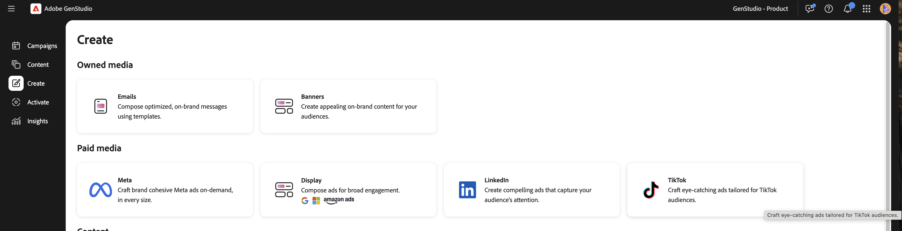

# TikTok體驗

使用[!DNL GenStudio for Performance Marketing]，您可以在[[!DNL Create]](/help/user-guide/create/overview.md)工作流程中建立TikTok廣告作為付費媒體體驗。 產生創意變體、執行品牌和管道檢查、發佈至[!DNL Content]，並透過[[!DNL Activate]](/help/user-guide/activation/overview.md)啟用，以將內容傳遞至TikTok Ads Manager以供最終稽核和啟動。

[!DNL GenStudio for Performance Marketing]中的TikTok適合更廣範圍的全通路工作流程：您可以連同其他社交和顯示管道（例如Meta和LinkedIn）一起分析[[!DNL Insights]](/help/user-guide/insights/overview.md)中的TikTok行銷活動和廣告效益，而不需要切換到個別的報告工具。

[!DNL Insights]個表面量度，包括：

* 印象
* 點按次數
* 點進率(CTR)
* 每次點按成本(CPC)
* 每次收購成本(CPA)
* 每毫升成本(CPM)
* 支出

檢視您的結果、比較創意成效，以及調整目標定位和預算，全都集中在一處。 每日資料更新可幫助您在不離開[!DNL GenStudio for Performance Marketing]的情況下更快速地最佳化。

## 先決條件

在建立或啟用TikTok廣告之前，請先完成下列工作：

### 存取權和角色

確定您在GenStudio for Performance Marketing中擁有&#x200B;**編輯者**&#x200B;角色或以上版本。 請參閱[使用者角色和許可權](/help/user-guide/user-roles.md)。

### 連線您的TikTok Ads帳戶

1. 移至&#x200B;**[!UICONTROL 設定]** > **[!UICONTROL TikTok]** > **[!UICONTROL 管理]** > **[!UICONTROL 新增帳戶]**。
1. 在快顯視窗中，登入TikTok Ads Manager。
1. 確定您有&#x200B;**操作員**&#x200B;或&#x200B;**管理員**&#x200B;存取廣告帳戶的許可權。
1. 新增TikTok作為管道，並完成TikTok Ads Manager的OAuth登入。

### 啟動設定

系統管理員已在[!DNL Activate]中連線您的TikTok Ads帳戶：

* 至少啟用一個TikTok廣告帳戶以供使用。

### 建立設定

* 已設定您的[品牌、產品和角色](/help/user-guide/guidelines/overview.md)，讓應用程式可以產生品牌上的復本和版面配置。
* 至少會上傳一個TikTok範本。 Adobe建議使用TikTok垂直影片範本，此範本已針對摘要位置最佳化，並具有&#x200B;**9:16**&#x200B;外觀比例，以及頂端和底部UI的安全區域。
* 視訊已上傳至[!DNL Content]。

## 產生TikTok資訊源內廣告

### 開始TikTok體驗

建立工作流程中的{width="90%"}
**若要開始TikTok體驗**：

1. 移至&#x200B;**[!UICONTROL 建立]**&#x200B;並選擇&#x200B;**[!UICONTROL TikTok]**。
1. 選取TikTok範本，然後按一下&#x200B;**[!UICONTROL 使用]**。
1. 在畫布中，選取&#x200B;**[!UICONTROL 品牌]**、**[!UICONTROL 產品]**、**[!UICONTROL 角色]**&#x200B;和&#x200B;**[!UICONTROL 語言]**。
1. 從[!DNL Content]中選取影片。
1. 輸入TikTok標題復本的提示。
1. 按一下&#x200B;**[!UICONTROL 產生]**。
   {width="40%"}

GenStudio for Performance Marketing會產生四種創意變體。

您可以：

* 使用&#x200B;**[!UICONTROL 重新產生]**&#x200B;或&#x200B;**[!UICONTROL 調整]**&#x200B;來調整色調、長度或強調。
* 直接在畫布中編輯文字。
* 使用&#x200B;**[!UICONTROL 交換]**&#x200B;從[!DNL Content]選取替代視訊。
* 使用&#x200B;**[!UICONTROL 裁切]**&#x200B;或&#x200B;**[!UICONTROL 重新框架]**&#x200B;調整&#x200B;**9:16**&#x200B;框架內的視訊配置。

### 執行品牌和管道檢查

在您儲存或傳送體驗以供檢閱之前，請先執行內容檢查：

1. 按一下&#x200B;**[!UICONTROL 內容檢查]** （品牌和管道檢查）。
1. 檢閱下列專案的驗證結果：
   * **品牌指導方針** — 色調、限制用語、標誌使用。
   * **TikTok管道規則** — 外觀比例、檔案型別、複製長度。
1. 解決任何標幟的問題（例如，複製長度或密集的熒幕文字）。

如需內容檢查的詳細資訊，請參閱[品牌驗證](/help/user-guide/guidelines/brand-validation.md)。

## 在GenStudio for Performance Marketing中儲存TikTok廣告

將您的TikTok體驗移至[!DNL Content]資料庫，以便檢閱、重複使用和啟用。
有兩種狀態：

* **草稿體驗** — 工作進行中且未核准。
* **已發佈的體驗** — [!DNL Content]已核准且可供啟用的內容。

### 傳送以供檢閱

**傳送以進行檢閱**：

1. 在&#x200B;**[!DNL Experience]**&#x200B;標題中，按一下&#x200B;**[!UICONTROL 要求稽核]**。
1. 選取核准者（例如，品牌、法律或績效）。
   * （選擇性）在&#x200B;**[!UICONTROL 設定]**&#x200B;中新增附註。
1. 按一下&#x200B;**[!UICONTROL 傳送以供檢閱]**。

核准者可以檢視視訊預覽、說明，以及call to action (CTA)和品牌與管道檢查結果。 他們可以核准體驗或請求變更。

### 發佈至[!DNL Content]

在所有必要的核准後：

1. 按一下&#x200B;**[!UICONTROL 發佈至內容]**。
1. 確認中繼資料：
   * 促銷活動或啟用名稱
   * 地區、語言、角色、funnel階段
   * 頻道： TikTok
1. 點擊&#x200B;**[!UICONTROL 發佈]**。

TikTok廣告現在出現在[!DNL Content]中。 可以使用[!DNL Channel]或[!DNL Campaign]等篩選器找到它，而且可以在[!DNL Activate]中選取它。

## 啟動TikTok廣告

TikTok啟用使用與Meta和Campaign Manager 360 (CM360)相同的[!DNL Activate]模組。 您可以從[!DNL Content]工作流程或[!DNL Activate]工作流程開始。

**若要開始TikTok啟用**：

1. 開啟「TikTok頻道」圖磚。
1. 按一下&#x200B;**[!UICONTROL 建立啟用]**。
1. 從[!DNL Content]中選取一或多個已發佈的TikTok體驗。

每個體驗通常會對應至一個TikTok廣告，其中包含一或多個視訊變體。

### 設定體驗設定

對於每個選取的體驗，確認：

* 主要文字
* call to action
* 目的地URL

### 設定平台設定

提供TikTok Ads Manager的詳細資訊，例如：

* TikTok Ads帳戶
* Campaign
* 廣告群組
* 廣告名稱（每個TikTok廣告一個）

### 檢閱和發佈

1. 檢閱所有創意和平台細節。
1. 點擊&#x200B;**[!UICONTROL 發佈]**。

GenStudio for Performance Marketing以暫停或草稿狀態將廣告推送至TikTok Ads Manager。

### 後續步驟

_正在發佈_&#x200B;強制回應視窗出現並自動關閉。 系統會將您重新導向至TikTok啟用表格。

{width="30%"}

啟用表格顯示最新的啟用，處理完成時狀態為&#x200B;**擱置中**。您可以在發佈完成時瀏覽離開。

{width="90%"}

完成後，確認快顯視窗會顯示成功或失敗訊息。 如果您按一下該快顯視窗，或按一下啟用表格中的TikTok啟用，則會開啟&#x200B;**詳細資料**&#x200B;頁面。 **詳細資料**&#x200B;頁面包含完整啟用資訊，以及TikTok Ads Manager中已發佈廣告的深層連結。

如果啟用失敗，會顯示&#x200B;**失敗**&#x200B;狀態並顯示TikTok的錯誤訊息。

在TikTok Ads Manager中，媒體團隊可以：

* 執行最終檢查。
* 讓廣告或廣告群組上線。

就像其他管道一樣，GenStudio for Performance Marketing會在非作用中狀態提供創意，因此管道擁有者可以控制最終啟動時間和預算。
