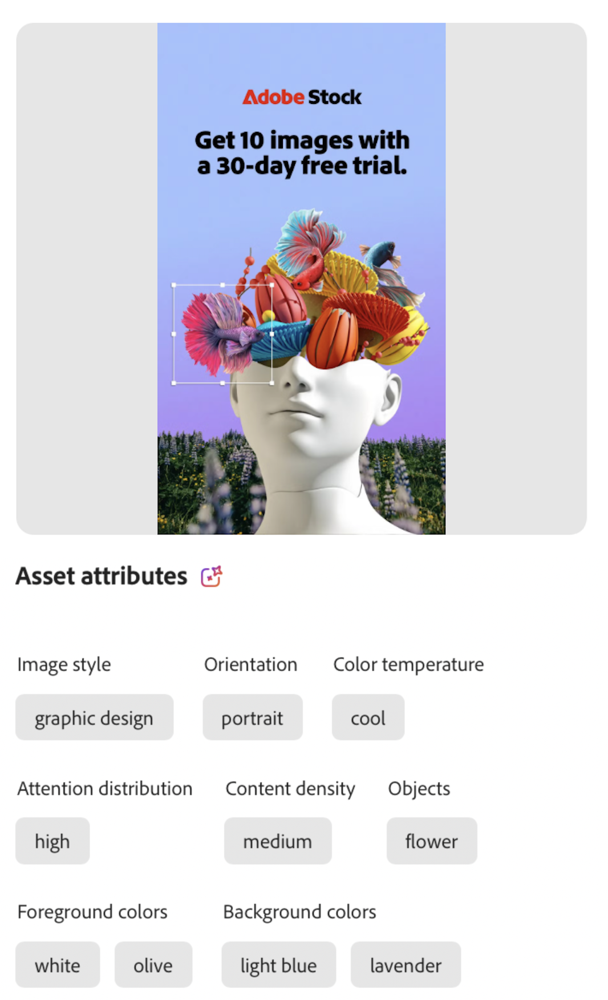
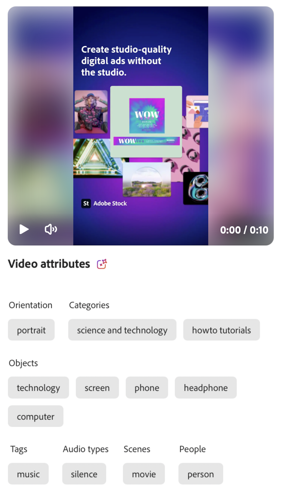

# 屬性類別

屬性類別是一種分類群組，可組織具有共同特性的相關屬性。 這些類別可提供更豐富的情境並便利其應用與使用，有助於簡化特定屬性的探索、識別和理解。

GenStudio for Performance Marketing使用Adobe的AI和機器學習功能來研究影像、影片和文字，並根據信賴度等級套用[!UICONTROL 資產屬性]。 _信賴度_&#x200B;指AI指派給預測或分類的機率。 在機器學習的語境中，這是一種分數，用於衡量AI對分類是否「有信心」。 可信度分數越高，確定性就越強。 例如，在分析影像時，AI可能會識別數個功能，並為每個功能指派一個分數，以表示此功能是否正確的信心。 資產的屬性清單並非詳盡無遺。 包含一組豐富功能的Assets可能僅限於信賴臨界值，例如已識別的三個最主要功能。

## 影像功能

影像功能代表影像中用於[!DNL Insights]分析的不同資訊元素或模式。 下表列出GenStudio for Performance Marketing AI識別的影像功能類別。

<!-- For the writer: turn off word wrap to work with these tables. Option + Z -->

| 類別 | 說明 | 範例 |
| ----------------------- | ----------------------------------------------------------------------------------------------------- | ------------------------------------------------------------------------------------------------------------------------------------------------------------------------------ |
| 攝影機角度 | 相機相對於主體的位置和角度。 |                                                                                                                                                                                |
| 主題距離 | 相機與影像主體之間的距離。 | `close up`, `mid shot`, `long shot` |
| 相機設定 | 用來產生影像的相機控制項的設定。 |                                                                                                                                                                                |
| 色彩和色調 | 評估影像元素中使用的顏色。 識別下列影像圖層中40種預先決定色彩的一至三種色彩：  **[!UICONTROL 前景色彩&#x200B;]**— 影像前方圖層的元素 **[!UICONTROL 背景色彩]** — 影像後方圖層的元素
**[!UICONTROL 色溫]**&#x200B;描述影像中顏色的一般暖色或冷色。 色調或溫度值： `warm`、`cool`、`neutral` | {width="200" zoomable="yes"} |
| 影像樣式 | 影像的視覺化處理。 |                                                                                                                                                                                |
| 照明條件 | 影像中的光線型別。 |                                                                                                                                                                                |
| 物件 | 識別構成影像的一或多個專案、圖元和元素。 | {width="200" zoomable="yes"} |
| 方向 | 相對於外觀比例的影像位置。 | `landscape`, `portrait`, `square` |
| 人員 | 當至少有一個人在場時，一個或多個屬性可以描述影像中的一個或多個人。 | {width="200" zoomable="yes"} |
| 攝影流派 | 偵測用於擷取影像的主旨和技術，例如`abstract`或`landscape` （與橫向不同）。 |           |
| 場景 | 偵測影像中所描述的設定或環境。 |                                             |
| 標記 | 偵測不屬於特定分類的物件、元素和其他影像特性。 |                                      |

<!-- Not yet approved by legal
| Attention distribution  | The level of viewer attention spread across an image.                                                 | `high`, `medium`, `low`                                                                                                                                                                                                    |
| Content density         | The amount of information or detail in an image.                                                      | `high`, `medium`, `low`                                                                                                                                                                                                    |
-->

## 視訊功能

影像功能代表視訊中不同的資訊元素、聲音或模式，以透過[!DNL Insights]進行分析。 下表列出GenStudio for Performance Marketing AI識別的視訊功能類別。

| 類別 | 說明 | 範例 |
| ------------------- | ------------------------------------------------------------------------------------------------------------ | --------------------------------------------------------------------------------------- |
| 音訊型別 | 當音樂出現時，視訊可能會收到一種音樂風格的分類，例如`electronic`或`classical`。 |          |
| 音訊型別類別 | 當音樂出現時，視訊可能會收到一個廣泛的音樂型別，例如`acoustic`或`traditional`。 |          |
| 音訊心情 | 描述音訊的一般氣氛或音調，例如`relaxing`或`energetic`。 |          |
| 音訊型別 | 當音訊出現時，視訊可能會收到一或多個音訊型別（例如`music`或`speech`）的標籤。 |          |
| 物件 | 識別視訊中出現的一或多個專案、實體和元素。 | 視訊中的{width="200" zoomable="yes"} |
| 方向 | 視訊相對於影格外觀比例的位置。 | `landscape`, `portrait`, `square` |
| 人員 | 當至少有一個人在場時，一個或多個屬性可以描述影片中的一個或多個人。 |        |
| 場景 | 影片中描述的設定或環境。 |        |
| 樣式 | 偵測套用到視訊中元素的視覺處理，例如`matte`或`neon`。 |        |
| 標記 | 偵測不屬於特定分類的物件、元素和其他視訊特性。 |        |

## 文字功能

文字功能包括某些文字元素的計數，例如文字、句子、表情符號，以及使用[!DNL Insights]進行分析時所使用的語意、情緒和語調的分類。 文字也可能收到可讀性分數。 即將推出。

<!-- Not yet approved by legal

The following table lists the image feature categories recognized by the GenStudio for Performance Marketing AI.

| Category             | Description | Example |
|----------------------|-------------|--------|
| Emojis Count         |             |        |
| HashTags Count       |             |        |
| Keywords             |             |        |
| Marketing Emotions   |             |        |
| Narratives           | Text that represents an overarching situation, theme, or a story. Narratives can communicate values, purpose, or identity that resonates with consumers on many levels.   |        |
| Persuasion Strategies|             |        |
| Readability          |             |        |
| Tone of voice        | | |
-->
