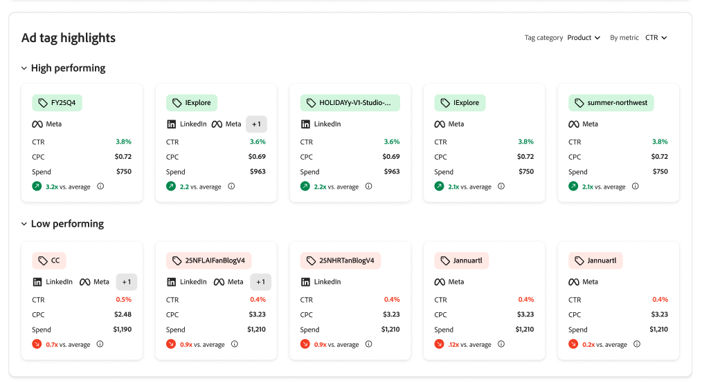

# Adobe GenStudio for Performance Marketing Insights

Adobe GenStudio for Performance Marketing [!DNL Insights]提供內容效能的進階分析和深入分析，可協助您做出資料導向式決策。

從[!DNL Insights]儀表板，您可以：

- **識別最有效的內容**：精確定位哪些內容最適合不同的對象，並量身打造未來的內容或行銷活動，以符合趨勢偏好設定。
- **最佳化表現不佳的內容**：尋找表現不佳的內容，並使用整合的產生式AI立即建立變數，在不從頭開始的情況下提升其成效。
- **振興高績效內容**：取得成功內容並調整內容以重新整理對象的廣告，或調整主圖內容以用於新的行銷活動，可能會延長其生命週期和績效。

[!DNL Insights]模組包含&#x200B;**[!UICONTROL Insights 2.0]**，付費社交的跨管道效能體驗。 它可與本文章[儀表板](#dashboard)區段中的詳細表格和相簿檢視搭配使用。

## Insights 2.0 {#insights-20}

**[!UICONTROL Insights 2.0]**&#x200B;提供績效智慧層，讓行銷人員清楚瞭解跨連線帳戶的付費社交行銷表現。

**在[!UICONTROL Insights 2.0]中，您可以：**

- **檢閱跨管道或單一管道概述（Meta和LinkedIn）**：檢視兩個付費社交管道的整合快照，或深入研究一個管道。
- **使用跨管道效能報表**：以貢獻百分比視覺效果檢視每個管道的份額結果，包括總支出（百分比和金額）和效能份額量度，例如CTR、CPC和CPM。
  
- **使用廣告績效報告**：識別具有支援最佳化決定之排名和量度的高績效和低績效廣告。
  
- **分析Meta轉換量度**：著重於可跨funnel階段顯示CPA的轉換（例如，參與造訪、資訊要求、應用程式開始、潛在客戶及應用程式完成），並檢閱一段時間內的轉換趨勢，可在GenStudio for Performance Marketing中使用轉換資料。
  
- **探索來自廣告標籤的深入分析**：廣告追蹤ID會剖析為結構化標籤，因此您可以依您定義的維度（例如call to action、地理位置、格式或概念）來分析效能、檢視這些維度的預算分配，並手動花更少的時間來解碼命名慣例。
  

>[!NOTE]
>
>**[!UICONTROL Insights 2.0]**&#x200B;目前僅包含&#x200B;**Meta**&#x200B;和&#x200B;**LinkedIn**。 TikTok、DV360和Innovid目前不在&#x200B;**[!UICONTROL Insights 2.0]**&#x200B;總覽中。 [儀表板](#dashboard)區段中的&#x200B;**[!UICONTROL 行銷活動]**、**[!UICONTROL 廣告]**、**[!UICONTROL 媒體]**&#x200B;和&#x200B;**[!UICONTROL 屬性]**&#x200B;檢視仍支援[支援的管道](#channels-supported)中說明的較廣泛管道集。

## 資料聯結器

第一次開啟[!DNL Insights]時，您可能會看到橫幅，引導您將Adobe GenStudio for Performance Marketing與管道帳戶連線。

此連線可讓GenStudio for Performance Marketing接收來自作用中行銷活動、媒體和廣告的統計資料。 最初，GenStudio for Performance Marketing會擷取最近6個月的資料，讓您擁有工具來分析最新資料並採取行動。

{{connect-insights}}

## 支援的管道 {#channels-supported}

Insights支援的管道包括Meta、LinkedIn、TikTok、DV360和Innovid。

Meta、LinkedIn和TikTok可完整顯示行銷活動、廣告、媒體和屬性。 DV360和Innovid目前提供的資料涵蓋範圍更為有限。

目前，DV360和Innovid無法使用「媒體」資料，這表示這些管道的「屬性」標籤也不會顯示。 「屬性」標籤取決於媒體層級資料，以顯示從體驗擷取的特徵。

此限制來自付費媒體平台本身的限制，而非GenStudio for Performance Marketing的問題。

## 儀表板 {#dashboard}

[!DNL Insights]儀表板具有每個內容型別的可設定資料表： [!UICONTROL 管道]、[!UICONTROL 廣告]、[!UICONTROL 媒體]和[!UICONTROL 屬性]。

![[!DNL Insights]儀表板](/help/assets/insights-dashboard.png)

每個檢視都會顯示對應的表格，您可以依關鍵字、篩選和日期範圍進行搜尋。 您可以按一下表格右側上方的設定(cog)圖示，以切換可檢視欄型別。 _[!UICONTROL 摘要]_&#x200B;列可能會顯示欄的總計或平均值。

[!UICONTROL 廣告]、[!UICONTROL 媒體]和[!UICONTROL 屬性]包含相簿檢視，可讓您使用具有影像或視訊縮圖的卡片來掃描和排序資產。 每個卡片都可選擇顯示三個關鍵量度之一： `Click-through rate`、`Cost per click`和`Spend`。

### 行銷活動

[[!DNL Insights] _[!UICONTROL 行銷活動&#x200B;]_&#x200B;檢視](campaigns.md)為預設檢視，並顯示作用中行銷活動詳細資訊的清單，例如目標、預算、啟動日期和活動。 請務必[連線管道帳戶](/help/user-guide/connectors/connect-channel.md)，讓GenStudio for Performance Marketing開始接收您的統計資料。

### 已發佈的體驗

[[!DNL Insights] _[!UICONTROL 已發佈的體驗詳細資料&#x200B;]_&#x200B;檢視](published-experiences.md)著重於評估體驗的成效。 [!UICONTROL 已發佈的體驗]檢視可讓您根據體驗在指定日期範圍內的位置來分析體驗的量度。 按一下&#x200B;_[!UICONTROL &#x200B;體驗名稱&#x200B;]_，即可檢視體驗效能量度、各位置的效能量度和屬性。

### 媒體

[[!DNL Insights] _[!UICONTROL 媒體&#x200B;]_&#x200B;檢視](media.md)可協助您分析創意內容的效能。 您可以識別有助於改善所選量度的媒體屬性，例如點按數或曝光數。

按一下媒體內容，可針對不同廣告和廣告投放位置提供其績效的進一步相關情境：

{width="600" zoomable="yes"}

在媒體詳細資料檢視中，左側會顯示資產的縮圖和屬性清單。 有三個醒目提示的量度： `Click-through rate`、`Cost per click`和`Spend`。 效能反白顯示實際值（實線）與所選時段內的平均值（虛線）相較之下的結果（預設為`Last 30 days`）。

### 屬性

媒體&#x200B;_屬性_&#x200B;可透過固有細節(例如色彩、色調、組合（例如主旨、字型、視覺元素）和其他關鍵元件)協助識別創意內容。 屬性通常是一組經過最少測量和分析的內容資訊。

[[!DNL Insights] _[!UICONTROL 屬性&#x200B;]_&#x200B;檢視](attributes.md)可協助您調查並識別哪些屬性對特定對象、管道、地區表現較佳，並可協助您強調季節性趨勢。 透過這些深入分析，您可以使用效能屬性來建立變體、鎖定特定對象，或實驗不同的行銷活動策略。

### 廣告標籤

[[!DNL Insights] _[!UICONTROL 廣告標籤&#x200B;]_&#x200B;檢視](ad-tags.md)顯示已連線頻道廣告帳戶的廣告清單。_&#x200B;廣告&#x200B;_是一種促銷資產，包含視覺和互動式內容，旨在作為行銷活動的一部分發佈給特定對象。
