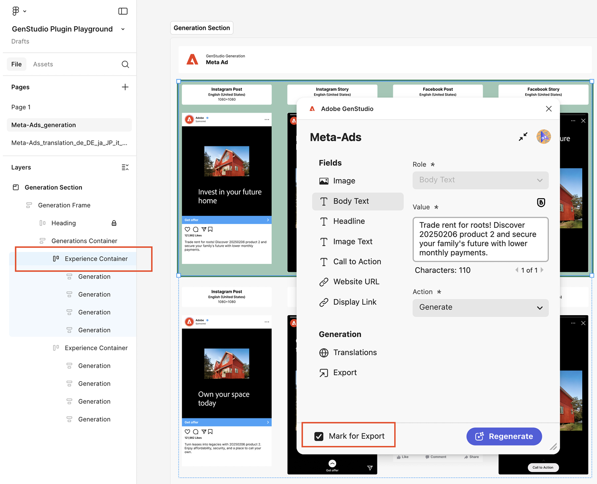
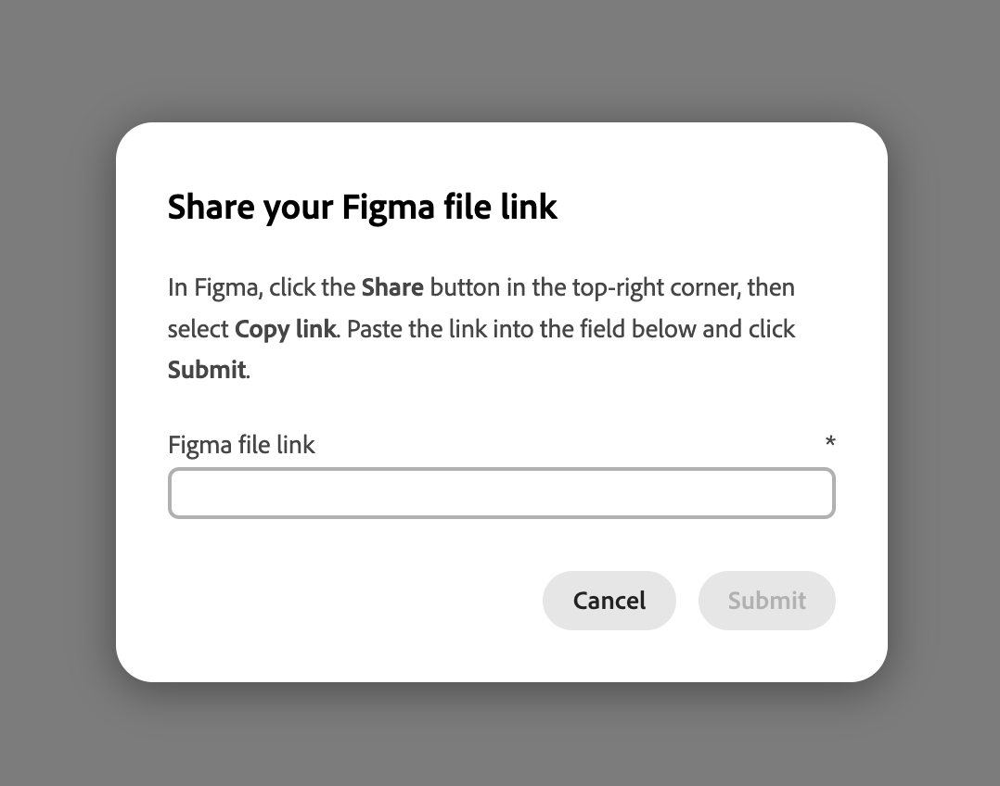

# GenStudio for Performance Marketing的Figma外掛程式

GenStudio for Performance Marketing Figma外掛程式會在Figma應用程式中新增面板，讓您產生品牌內內容。
[從Figma社群市集](https://www.figma.com/community/plugin/1604251370122180013/firefly-enterprise-and-genstudio)尋找並安裝外掛程式。

此頁面說明如何設定及使用外掛程式。

此外掛程式的功能包括：

* 將Figma文字元素對應至GenStudio for Performance Marketing欄位，例如`headline`、`body`、`on_image_text`等。
* 根據品牌、角色、產品和文字提示產生新的品牌內Meta、LinkedIn或顯示廣告[!DNL Experiences]。
* 將對應的Figma元素中的文字取代為GenStudio for Performance Marketing產生的值，以直接在Figma檔案中建立[!DNL Experiences]。
* 根據提示重新片語、縮短、延長或翻譯現有內容。
* 將產生的[!DNL Experiences]翻譯成多種語言。
* 將產生的[!DNL Experiences]匯出至本機來源，做為平面化的影像。
* 將產生的[!DNL Experiences]匯出至GenStudio for Performance Marketing。
* 使用可調整成圖形畫布中所選元素的外掛程式選項。

>[!VIDEO](https://video.tv.adobe.com/v/3478820?captions=chi_hant&learn=on)

## 建立範本

外掛程式要求Figma檔案的前兩個層級遵循此慣例：

* **Section** — 這代表可包含多個範本的父專案。
* **框架** — 這表示專案中的範本。 範本中可填入文字、影像、元件和其他元素。

### Meta範本

支援的範本大小如下：

針對Instagram或Facebook貼文：

* 寬度：1080畫素（固定）
* 高度：1080畫素或1350畫素

若為Instagram或Facebook故事：

* 寬度：1080畫素（固定）
* 高度：1920畫素

外掛程式會根據範本的高度來決定所產生體驗的顏色。

### 顯示範本

沒有固定大小的要求。 顯示範本支援任何大小。

### LinkedIn範本

* 寬度：1200畫素（固定）
* 高度：1200畫素、628畫素、2292畫素、1800畫素或1500畫素

### 欄位角色對應

外掛程式需要瞭解範本的不同元素，例如標題、本文文字或影像。

**Meta欄位角色包括**：

* 影像
* 影像文字
* CTA
* 內文
* 標題
* 網站URL
* 顯示連結
* 手動欄位

檢視以下這些欄位角色中的對應方式。

| {width="60%" align="center" zoomable="yes"}  | {width="70%" align="center" zoomable="yes"}  |
|:---:|:---:|
| {width="60%" align="center" zoomable="yes"}  | {width="70%" align="center" zoomable="yes"}  |

**LinkedIn欄位角色包括**：

* 影像
* 簡介文字
* 影像文字
* 標題
* CTA
* 網站URL
* 手動欄位

檢視以下這些欄位角色中的對應方式。

{width="30%" align="center" zoomable="yes"}

外掛程式會記住這些對應，以便用於產生的內容。 欄位角色可以對應至多個範本元素。 手動欄位適用於您想要保留文字可讀性，但不會標示為要產生的元素。

>[!IMPORTANT]
>
> **您必須將`image`欄位角色指派給範本中至少一個影像元素，以對應影像**。

若要指派元素角色：

1. 在範本中選取元素（文字、影像等）。
1. 使用下拉式選單來指派角色。

{width="60%" zoomable="yes"}

{{$include /help/_includes/field-mapping-exceptions.md}}

## 產生新內容

使用GenStudio for Performance Marketing AI來產生或產生圖形範本中元素的變數。

1. 如果您使用GenStudio外掛程式遊樂場或已經準備好的範本，請選取包含您的廣告範本的區段節點。 您可以從&#x200B;**圖層**&#x200B;面板或直接按一下畫布的區段來執行此操作。
   {width="50%" zoomable="yes"}
1. 在外掛程式視窗中，輸入變數的專案名稱、選擇內容的平台，並填寫其他必要資訊。 然後按一下&#x200B;**[!UICONTROL 完成設定]**&#x200B;按鈕。
   {width="30%" zoomable="yes"}
1. 選取要用於產生內容的[!DNL Brand]、[!DNL Persona]和[!DNL Product]。
1. 選取要產生的變數數量（最多八個）。
1. 使用「**[!UICONTROL 選取內容]**」下的按鈕，從您的資產中瀏覽並選擇影像。 最近新增的40個資產會先出現，您可以搜尋其他資產。 選取的影像會自動調整大小以符合您的範本。
1. 輸入文字提示。 **[!UICONTROL 欄位]**&#x200B;清單中的每個欄位都將&#x200B;**[!UICONTROL 動作]**&#x200B;選項設定為&#x200B;**[!UICONTROL 產生新內容的]**。
1. 對應所有欄位角色。 請參閱[欄位角色對應](#field-role-mapping)。
1. 按一下&#x200B;**[!UICONTROL 產生]**&#x200B;按鈕。

## 從現有內容翻譯或產生廣告副本變數

使用GenStudio for Performance Marketing AI產生廣告複製變化或翻譯圖形範本。

1. 選取包含廣告範本的區段節點。 您可以從&#x200B;**圖層**&#x200B;面板或直接按一下畫布的區段來執行此操作。
   {width="50%" zoomable="yes"}
1. 在外掛程式視窗中，輸入變數的專案名稱，然後選擇內容的平台。
1. 在&#x200B;**[!UICONTROL 目標為何？]**，選取&#x200B;**[!UICONTROL 產生變數]**&#x200B;或&#x200B;**[!UICONTROL 翻譯]**，然後按一下&#x200B;**[!UICONTROL 完成設定]**&#x200B;按鈕。
   {width="30%" zoomable="yes"}
1. 選取要用於產生內容的[!DNL Brand]、[!DNL Persona]和[!DNL Product]。
1. 選取要產生的變數數目。
1. 使用「**[!UICONTROL 選取內容]**」下的按鈕，從您的資產中瀏覽並選擇影像。 最近新增的40個資產會先出現，您可以搜尋其他資產。 選取的影像會自動調整大小以符合您的範本。
1. 輸入文字提示。 **[!UICONTROL 欄位]**&#x200B;清單中的每個欄位都將&#x200B;**[!UICONTROL 動作]**&#x200B;選項設定為&#x200B;**[!UICONTROL 產生新內容的]**。
1. 對應所有欄位角色。 請參閱[欄位角色對應](#field-role-mapping)。
1. 選取每個欄位型別，以產生變數或在外掛程式左側的面板中翻譯，然後將初始內容貼到每個&#x200B;**[!UICONTROL 初始內容]**&#x200B;方塊中。
   {width="60%" zoomable="yes"}
1. 按一下&#x200B;**[!UICONTROL 產生]**&#x200B;按鈕。

## 層代後翻譯內容

1. 選取您要翻譯的層代。
   {width="20%" zoomable="yes"}
1. 選擇&#x200B;**[!UICONTROL 翻譯]**，然後按一下&#x200B;**[!UICONTROL 翻譯]**。
1. 選取您的目標語言。
1. 按一下「**[!UICONTROL 選取]**」。

翻譯結果包括：

* 新頁面會出現，並包含翻譯的內容。
* 每個翻譯都會顯示目標語言或地區設定。
* 原始內容在原始頁面中保持不變。

{width="60%" zoomable="yes"}

## 產生後內容欄位上的其他動作

編輯欄位中的現有內容時，外掛程式面板中會顯示有用的選項。

{width="30%" zoomable="yes"}

選項包括：

* 變更&#x200B;**[!UICONTROL 值]**&#x200B;以直接變更文字。 變更此內容會自動套用至所有選取的變數。
* AI可執行許多&#x200B;**[!UICONTROL 動作]**&#x200B;選項，包括：

| 動作 | 說明 |
| --- | --- |
| **[!UICONTROL 產生]** | 產生新的文字變化。 |
| **[!UICONTROL 重述]** | 產生新的文字變化。 |
| **[!UICONTROL 縮短]** | 產生較短的文字變化。 |
| **[!UICONTROL 長度]** | 產生較長的文字變化。 |

選取&#x200B;**[!UICONTROL 動作]**&#x200B;選項之後，使用&#x200B;**[!UICONTROL 重新產生]**&#x200B;按鈕重新產生內容。

## 匯出體驗

變數可從Figma匯出為GenStudio for Performance Marketing [!DNL Experiences]。

1. 執行下列任一項作業，選取要匯出到圖形畫布中的內容：
   * 在畫布中選取產生區段，然後在外掛程式面板中按一下&#x200B;**[!UICONTROL 全部標籤為匯出]**。
     {width="20%" zoomable="yes"}
   * 在畫布中選取個別層代，然後在外掛程式面板中按一下&#x200B;**[!UICONTROL 標籤為匯出]**。
     {width="20%" zoomable="yes"}
1. 從側欄功能表選取「匯出」專案。
   針對Meta廣告顯示{width="60%" zoomable="yes"}
1. 選取目的地。
1. 按一下[匯出&#x200B;**&#x200B;**]以匯出內容。

已在外掛程式面板中建立ZIP檔案，或在GenStudio **中顯示**&#x200B;開啟的連結。 使用ZIP連結來選擇儲存檔案的位置，或選取&#x200B;**[!UICONTROL 在GenStudio中開啟]**。

## 將Figma框架轉換為Photoshop

>[!NOTE]
>
> 若要執行此工作，您同時需要Figma外掛程式和[GenStudio Photoshop](photoshop-plugin.md)。

您可以使用Figma外掛程式將影格、多個影格或整個檔案轉換為Photoshop格式，然後匯出以用於[GenStudio Photoshop](photoshop-plugin.md)。 目前，轉換期間僅支援主要屬性，例如可見度、字型大小以及基本圖層屬性。 目前尚不支援刪除線、上標、下標、百分比形式的不透明度、漸層和類似的進階屬性等功能。

外掛程式支援下列Figma圖層型別的轉換：

* **框架**
* **群組**
* **執行個體**
* **文字**
* **向量**
* **影像**

轉換為PSD時，支援的圖層會對應到Photoshop，如下所示：

| 圖形圖層型別 | 轉換為Photoshop | 附註 |
| --- | --- | --- |
| **框架** | 圖層群組 | <ul><li>圖形影格會轉換為Photoshop圖層群組。</li><li>巢狀框架會變成巢狀群組。</li><li>框架尺寸會成為PSD工作區域或群組界限（視選取範圍而定）。</li></ul> |
| **群組** | 圖層群組 | <ul><li>圖形群組會直接轉換成Photoshop圖層群組。</li><li>圖層階層和棧疊順序會保留。</li></ul> |
| **執行個體** | 圖層群組 | <ul><li>元件和例證會平面化為標準的Photoshop圖層群組。 未保留元件中繼資料和變體邏輯。</li><li>所有子圖層都會保留在群組內。</li></ul> |
| **文字** | 文字圖層 | <ul><li>圖形文字圖層會轉換為可編輯的Photoshop文字圖層。</li><li>會保留文字階層和位置。</li></ul> |
| **向量** | 形狀圖層 | <ul><li>圖形向量層會轉換為Photoshop形狀層。</li><li>儘可能保留路徑。</li><li>如果套用不支援的效果，則可能會點陣化複雜向量。</li></ul> |
| **影像** | 點陣化圖層 | <ul><li>圖形影像圖層會轉換為Photoshop點陣化圖層。</li><li>會保留影像縮放和定位。</li></ul> |

### 如何轉換框架

若要轉換框架：

1. 在Figma中開啟Firefly Enterprise和GenStudio外掛程式，然後按一下外掛程式UI中的&#x200B;**[!UICONTROL 匯出]**&#x200B;索引標籤。
1. 在畫布上，選取要匯出的一或多個影格。 您可以選擇單一框架或多個框架。
1. 執行下列其中一項：

   * 按一下[匯出&#x200B;**&#x200B;**]將轉換的檔案匯出至選擇的位置，或
   * 按一下&#x200B;**[!UICONTROL 傳輸至GenStudio Photoshop]**&#x200B;以快取轉換後的檔案，以便在GenStudio Photoshop中立即使用。
     {width="40%"}
1. 當出現&#x200B;**[!UICONTROL 需要檔案金鑰]**&#x200B;對話方塊時，外掛程式需要Figma檔案URL才能完成轉換。 新增檔案的URL：

   1. 在Figma中，按一下畫布右上角的&#x200B;**[!UICONTROL 共用]**。
   1. 在&#x200B;**[!UICONTROL 共用此檔案]**&#x200B;中，按一下&#x200B;**[!UICONTROL 複製連結]**。
   1. 將複製的連結貼到外掛程式對話方塊的&#x200B;**[!UICONTROL Figma檔案URL]**&#x200B;欄位中。

1. 按一下&#x200B;**[!UICONTROL 提交]**。 外掛程式會讀取圖形中選取的影格，並將其轉換為JSON檔案，這是檔案資料的中介格式。
   {width="35%"}
1. 在Photoshop中，開啟GenStudio Photoshop並按一下「**[!UICONTROL 匯入]**」標籤。
1. 執行下列其中一項：

   * 按一下&#x200B;**[!UICONTROL 從外掛程式]**，從快取檔案清單中選擇以&#x200B;**[!UICONTROL 傳輸到GenStudio Photoshop]**&#x200B;轉換的檔案，或
   * 按一下&#x200B;**[!UICONTROL 上傳JSON]**&#x200B;以瀏覽並選取要上傳的JSON檔案。
     {width="40%"}
1. GenStudio Photoshop會將JSON檔案中的資訊轉換為開啟的Photoshop檔案。
1. 按一下「**[!UICONTROL 完成]**」。 新檔案會在Photoshop中開啟並準備使用。 或按一下&#x200B;**[!UICONTROL 另存新檔……]**，選擇儲存檔案的位置。
   {width="40%"}

## 產生歷史記錄

外掛程式會維護每個欄位的變更記錄。 在範本頁面上，選擇外掛程式側邊欄中的&#x200B;**[!UICONTROL 產生歷程記錄]**。

已針對Meta廣告顯示{width="80%" zoomable="yes"}

## 疑難排解

如果在產生的變化中未取代文字或影像，請考量這些最佳實務和提示。

### 對應的欄位

如果未取代文字或影像，請檢查欄位是否已對應至外掛程式UI中的GenStudio欄位角色。 請參閱[欄位角色對應](#field-role-mapping)。

### 確認字型是否可用

文字欄位的字型必須可在您的電腦上使用，才能在產生期間進行取代。 確認檔案中使用的所有字型在您的電腦上均可用，尤其是當檔案是在其他電腦上建立時。

### 考慮欄位角色支援

某些管道僅支援在特定欄位中進行取代。 請注意[欄位角色對應](#field-role-mapping)的例外狀況。
