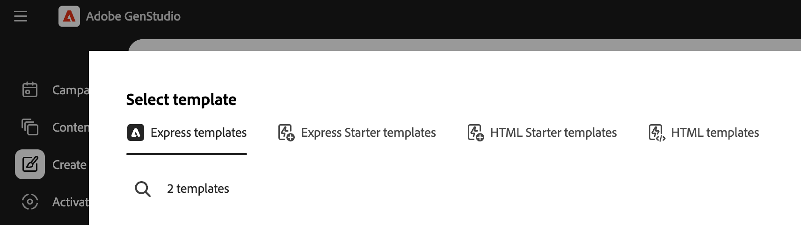
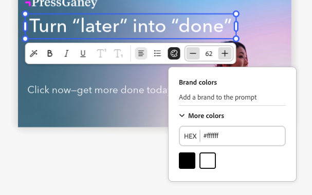
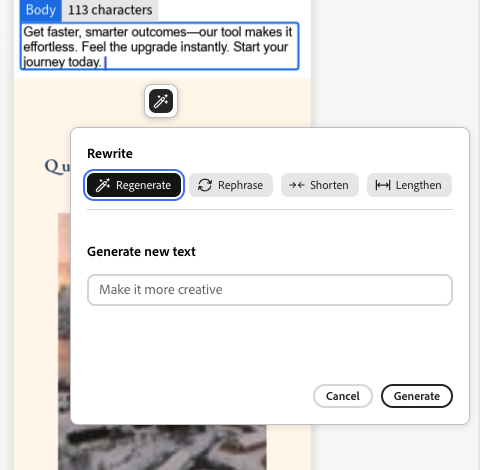

# 使用[!DNL Adobe Express]範本

[!DNL GenStudio for Performance Marketing]可以使用已在[!DNL Adobe Express]中建立和設計的範本。 從[!DNL Adobe Express]取得品牌資產，並使用這些強大的工具將它們整合到引人入勝的行銷活動和[!DNL Experiences]中。

本指南說明[!DNL Adobe Express]範本的需求和功能。

## 關於[!DNL Adobe Express]中的範本

在[!DNL Adobe Express]中，可以使用應用程式中提供的現有入門範本[&#128279;](https://helpx.adobe.com/tw/express/web/documents-and-presentations/text-flow-template.html?x-product=Helpx%2F1.0.0&x-product-location=Search%3AForums%3Alink%2F3.7.5)或包含實用品牌限制的[自訂範本](https://helpx.adobe.com/tw/express/web/brands-libraries-projects/create-manage-brands/edit-shared-template.html)來建立新檔案，例如：

- [無法變更的鎖定元素](https://helpx.adobe.com/tw/express/web/invite-collaborate/object-locking.html)
- 鎖定可控制使用者在需要時如何解鎖元素的限制

在[!DNL Adobe Express]中設定於範本的鎖定設定也將套用在[!DNL GenStudio for Performance Marketing]中。 使用[該 [!DNL Adobe Express] 指示建立具有品牌限制的自訂範本](https://helpx.adobe.com/tw/express/web/brands-libraries-projects/create-manage-brands/template-control.html)。

若要在Express範本中使用自訂字型，管理員必須先接受Admin Console中的「自訂字型」合格選件，此選件包含在Express授權權益中。

## 尋找快速範本

使用者將在建立中看到新索引標籤以選取快速範本。 當快速範本滿足以下條件時，您可在GenStudio for Performance Marketing中存取這些範本：

- 由使用者建立
- 已分享給使用者
- 已共用給使用者的組織，在兩個應用程式中使用相同的IMS組織

選取範本型別後，在「建立」工作流程中尋找任何可用的「快速」範本。 快速範本僅適用於下列型別：

- [!DNL Meta]
- [!DNL Display]
- [!DNL LinkedIn]
- [!DNL TikTok]

在&#x200B;**[!UICONTROL 選取範本]**&#x200B;下方的頂端列中，尋找&#x200B;**快速範本**。

{width=70%}

當您選取[!DNL Express]範本並按一下&#x200B;**[!UICONTROL 使用]**&#x200B;時，預先草稿引數和提示將顯示在左側的快顯面板中。 按一下&#x200B;**[!UICONTROL 產生]**&#x200B;按鈕，以使用選取的範本建立新內容。

{width=90%}

>[!IMPORTANT]
>
>在內容產生期間，Express範本圖層將自動標示[!DNL GenStudio for Performance Marketing]的欄位角色。 範本上的元素也可以是[手動標籤](#manual-tagging-of-templates)。

## 關於變體及具有[!DNL Adobe Express]範本的[!DNL Experiences]

[!DNL Express]範本提供許多您在[管理其他變體](https://experienceleague.adobe.com/zh-hant/docs/genstudio-for-performance-marketing/user-guide/create/manage-variants#manually-edit-text)時會熟悉的功能。 不過，有一些功能強大的新增功能，可簡化來自[!DNL Express]的內容之任何工作流程。 本節說明[!DNL Adobe Express]實作的專屬功能。

### 自動產生多種大小

在 [!DNL Express][&#128279;](https://helpx.adobe.com/tw/express/web/arrange-layers-and-pages/add-pages.html)中為資產建立多個頁面時，這些頁面會移轉至從該資產建立的任何範本。 快速頁面將在[!DNL GenStudio for Performance Marketing]中產生不同大小的創意內容。

當[!DNL Express]中的資產存在多個大小的內容時，可以在單一世代中為所有這些大小產生變體。

### 重新定位元素並調整其大小

只要在「畫布」窗格上按一下並拖曳範本上的元素，即可調整大小或移動元素以符合大小。

從轉角點按一下並拖曳元素以調整大小。

### 畫布窗格標題功能

使用「畫布」窗格標題中的按鈕可以：

1. 重新命名草稿
1. 變更要檢視的縮放等級
1. 還原和重做變更

### 指派體驗群組意見回饋

體驗標頭中的

將意見反應指派給每個產生的變體群組。 這些意見標籤可協助AI瞭解哪些變體應納入後續世代的考量。

按一下「……」 若要開啟下列專案的下拉式清單：

- 輸出良好
- 輸出不良
- 刪除 — 刪除變體群組。

### 刪除變體

您可以使用垃圾桶圖示刪除一組體驗中產生的單一變體大小。

{width=300}

### 空格鍵至平移

保留&#x200B;**[!UICONTROL 空間]**&#x200B;以啟用按一下並拖曳功能，以「提取」畫布檢視窗格。

您也可以使用雙指捲動來移動檢視窗格。

### 手動編輯文字

您可以編輯產生之變體中的文字欄位。 透過實驗不同的短語和措辭並套用格式，為您的對象調整文字。 例如，您可以粗體和右對齊變體的文字，以符合影像的版面。

{width=60%}

可用的文字格式包括：

- 粗體、斜體和底線
- 文字顏色（黑色、白色或品牌顏色）
- 靠左、靠中和靠右對齊
- 專案符號和順序清單
- 文字大小
- 上標或下標

**若要在產生的變化中手動編輯文字**：

1. 產生一組變體後，在變體中的可編輯文字上連按兩下。
1. 輸入新文字。
1. 若要設定文字的格式，請按一下或在文字方塊元素中輸入。 格式選項會出現在快顯列中。 按住Shift鍵會隱藏要檢視文字的列。
1. 按一下離開文字欄位以儲存任何變更。

### 檢檢視層

您可以快速選取變體的個別圖層並進行變更，例如重新產生截面或裁切影像。 當您選取個別圖層時，圖層內的可編輯欄位或影像會反白顯示。

**若要檢視變體**&#x200B;的圖層：

1. 產生一組變體後，按一下變體內的可編輯欄位或影像。 圖層會顯示在右上方的圖磚行中。
   {width=50%}
1. 按一下圖層圖磚來選取它。 選取的圖層會針對變體反白。
1. 繼續對選取的圖層進行任何必要的編輯。

### 重寫區段

[!DNL GenStudio for Performance Marketing]具有內建功能，可重新產生產生產生變體的區段。 您可以重述、縮短或加長文字，或新增提示以產生新內容。

例如，您可以重新產生一個Meta廣告變體的標題區段，以檢視它在特定背景資產中的外觀。 您可以&#x200B;**[!UICONTROL 重新撰寫詞句]**、**[!UICONTROL 縮短文字]**、或&#x200B;**[!UICONTROL 加長文字]**&#x200B;節的文字內容，或使用引導提示重新產生&#x200B;**[!UICONTROL 文字]**。

{width=50%}

**若要重寫個別變體區段**：

1. 產生一組變體後，按一下變體中的任何可編輯文字。 棒圖示隨即顯示。
1. 按一下棒圖示以開啟「重新寫入」窗格。
1. 若要變更現有文字，請選取&#x200B;**[!UICONTROL 重新片語]**、**[!UICONTROL 縮短文字]**&#x200B;或&#x200B;**[!UICONTROL 加長文字]**。
1. 若要產生新的措辭選項，請選取&#x200B;**[!UICONTROL 重新產生]**&#x200B;並輸入新的提示。
   1. 按一下&#x200B;**[!UICONTROL 產生]**。
1. 結果會以選項的形式顯示在窗格中。 選取想要的選項，然後按一下&#x200B;**[!UICONTROL 取代]**。 變體會以修訂後的文字更新。

{width=50%}

### 裁切資產

您可以使用裁切工具，以手動方式裁切和重新定位個別產生變體中的影像資產。

**若要裁切和重新定位變體中的影像**：

1. 產生一組變體後，按兩下資產以啟動邊界方框。
1. 從任何邊緣或角落拖曳，或是將整個影像拖曳至所需位置，即可調整影像邊界方框。

### 交換資產

您可以在產生的變體中，直接從畫布UI新增或交換影像、核准的標誌或視訊資產。

**若要在變體**&#x200B;中新增或交換資產：

1. 產生一組變體後，按一下資產(或影像資產區域（如果影像目前不存在）。 交換圖示隨即顯示。
1. 按一下交換圖示以開啟「選取資產」頁面。
1. 使用GenStudio資產內容檢視中的篩選和搜尋功能，進一步縮小搜尋結果的範圍。
1. 您也可以從&#x200B;**[!UICONTROL 位置]**&#x200B;選單中選取已連線[!DNL Adobe Experience Manager] (AEM) Assets Content Hub存放庫中的可用影像。
1. 按一下以選取影像，然後按一下&#x200B;**[!UICONTROL 使用]**。 影像已新增或交換到適用的變體中。

### 手動標籤範本

範本中的元素會在建立工作流程產生[範本](#find-express-templates)期間自動加上標籤。 但這些元素也可以手動標籤。

**若要手動標籤範本元素**：

1. 選取範本上的元素。
1. 使用下拉式清單來選取該元素的標籤。
   {width=80%}

標籤選項會因元素型別而異。

### 範本鎖定限制

範本可以包含從[!DNL Express]移轉過來的[鎖定元素](https://helpx.adobe.com/tw/express/web/invite-collaborate/object-locking.html)，並控制某些功能的變更方式。 範本會遵循這些設定，也可在範本上變更：

1. 在範本上選取鎖定的元素。
1. 按一下所選元素左上方的鎖定圖示。
1. 選取正確的選項以解除鎖定元素。
   {width=60%}

### 視訊元件

包含視訊的範本可利用視訊元件的功能。

**要使用視訊元件**：

1. 選取體驗並按一下&#x200B;**[!UICONTROL 編輯]**&#x200B;按鈕，進入焦點模式並使用視訊元件功能。 只會顯示單一變體，且會沿著底部顯示場景線。
   {width=70%}
1. 調整您的視訊體驗。 視訊元件選項包括：
   - 播放視訊
   - 將聲音設為靜音並取消靜音
   - 使用「+」按鈕新增視訊內容
   - 視訊持續時間設定
   - 使用拖放功能變更視訊內容的順序
1. 當您完成視訊編輯後，請使用頂端的&#x200B;**[!UICONTROL 退出]**&#x200B;按鈕來儲存變更並返回無限畫布。

### 使用產生式展開修改影像

影像圖層的邊界可透過AI擴展，以符合體驗中任何需要的尺寸。

**若要使用產生式展開來展開影像**：

1. 選取解除鎖定的影像層，然後按一下影像框底部的&#x200B;**[!UICONTROL 展開]**&#x200B;按鈕。
   {width=70%}
1. 將影格拉到影像將展開的所需尺寸。 將會出現「展開選項」視窗。 在「展開」選項中，您可以透過下列方式加速展開：
   - 輸入提示
   - 選擇符合框架
   - 重設維度
     {width=50%}
1. 按一下&#x200B;**[!UICONTROL 展開]**&#x200B;以建立層代。 可選擇的變體會出現在框架底部。
1. 選取最佳變體並按一下&#x200B;**[!UICONTROL 保留]**。
   {width=50%}

{width=60%}

### 品牌驗證

使用&#x200B;_內容檢查_&#x200B;面板，以維持一致的品牌識別、ADA協助工具標準、平台准則，以及對齊變體。

請參閱[品牌驗證](/help/user-guide/guidelines/brand-validation.md)。

## 檢閱和核准

編輯並調整變體後，使用[檢閱和核准工作流程](https://experienceleague.adobe.com/zh-hant/docs/genstudio-for-performance-marketing/user-guide/approve/overview)核准並發佈您的內容。

